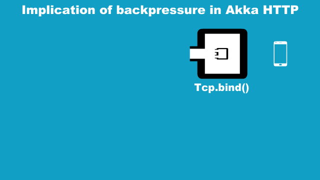

IT TURNED OUT THIS GIF IS WRONG! MY DEMO APP JUST CLOSED THE TCP CONNECTION INSTEAD OF STOP CONSUMING RESPONSES. THAT IS CONFIRMED BY ADDING SLF4J LOGGING TO THE DEMO, WHICH SAID:

> [DEBUG]Closing connection due to IO error java.io.IOException: An established connection was aborted by the software in your host machine
> [DEBUG][received] Downstream finished.

Looking at the official doc page [Implications of the streaming nature of Request/Response Entities](https://doc.akka.io/docs/akka-http/current/implications-of-streaming-http-entity.html), I found it's bit difficult to understand, so I am writing this article to explain the behavior described there, with illustration and a sample application demonstrating this "implicaiton".

## Demo

This must be a separate article as it requires a lot of effort building flexible client about how to make and consume HTTP response and requests:

   https://doc.akka.io/docs/akka-http/current/implications-of-streaming-http-entity.html → demo not consuming response entities
   What happens on lack of HTTP response consumption
  - what should we do when there is connection problem …? No way to avoid the connection get stuck? Retry behavior? do the demo to illustrate behavior 
  - What does “consumed” mean by the client on 

  TCP is a stateful connection
https://en.wikipedia.org/wiki/Stateless_protocol