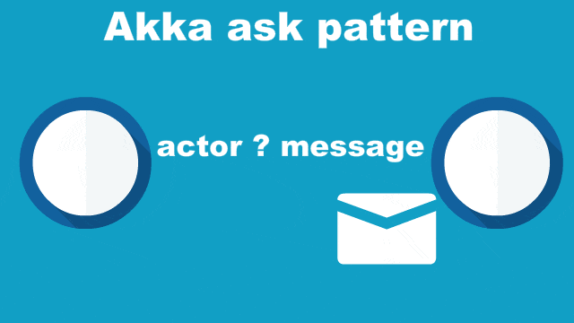
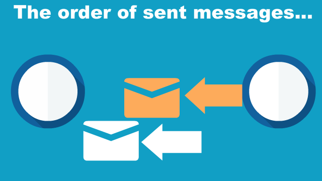
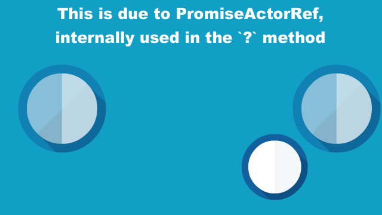

I'm writing this article because I wanted to share my little findings about Akka ask pattern's internal behavior, which are the use of `PromiseActorRef`.

While doing some experiments in Akka, I came up with a question about how the Akka ask pattern distinguishes multiple messages returned back in a random order from the target actor, and it turned out the answer was `PromiseActorRef`.

## Review of the Akka ask pattern, which uses the `?` method.

The Akka ask pattern is described [here in the official documentation](https://github.com/akka/akka/blob/v2.5.14/akka-actor/src/main/scala/akka/pattern/AskSupport.scala
), but we also review it here. You can skip this section if you are already familiar with it.

In Akka, there are basically two patterns to send a message betwen actors. The first is the **tell pattern**, which uses the `!` method.

```scala
actor ! message
```

This is the **fire-and-forget** style for sending a message, and used more prevalently than the other pattern in Akka-based applications.

The other pattern is called the **ask pattern**, which uses the `?` method to send a message and waits until there is a returning message back from the target `actor`.

```scala
import akka.pattern.ask
val fut: Future[Any] = actor ? message
```

The return type of the `?` method is `Future` so that the caller thread of the `?` method is not blocked, and upon target `actor` returning the resulting message to the sender, the `Future` is completed. 

Supplying necessary imports and declarations, the code looks like this:

```scala{1,3-10}
import akka.actor.ActorRef
import akka.pattern.ask
import scala.concurrent.Future
import scala.concurrent.duration._

val actor: ActorRef = ...
val message = ...

implicit ec: ExecutionContext = ...
implicit timeout: Timeout = 10.seconds
val fut: Future[Any] = actor ? message
```

and if you do this inside an `Actor`, it is done as follows:

```scala{1,6,9,17-18}
import akka.actor.{Actor, ActorRef}
import akka.pattern.ask
import scala.concurrent.Future
import scala.concurrent.duration._

class SenderActor extends Actor {
  val actor: ActorRef = ...

  def receive = {
    ...
    val message = ...
  
    implicit ec:ExecutionContext = context.dispatcher
    implicit timeout: Timeout = 10.seconds
    val fut: Future[Any] = actor ? message
    ...
  }
}
```


Under the hood, this `?` method invocation is implemented by Akka's message passing. So, what's the big deal about this and why its internal (`PromiseActorRef`) is interesting? To see that, let me introduce my question from the next section.

## Invoking two `Future`s by the `?` (ask) method

Instead of just invonking the `?` method once, let's invoke the `?` method for two different messages consecutively.

```scala{13-15}
import akka.actor.{Actor, ActorRef}
import akka.pattern.ask
import scala.concurrent.Future

class MyActor extends Actor {
  val actor: ActorRef = ...

  def receive = {
    ...
    val message = ...
  
    implicit ec: ExecutionContext = context.dispatcher
    // What if the actor replies earlier for someMessage2 than someMessage1?
    val fut1: Future[Any] = actor ? message1
    val fut2: Future[Any] = actor ? message2
    ...
  }
}
```

The target `Actor` can be like this, where it sends back the `result` to the original `sender` actor in the end.

```scala{9,12}
class TargetActor extends Actor {
  import TargetActor._
  def someBackendOperation(message: Message): Future[String] =
    ... // It might send messages to other actors,
        // or perform async database operations, etc

  def receive = {
    case message: Message =>
      val sender = sender() // sender is same for the two messages
      val resultFuture = someBackendOperation(message)
      resultFuture.onComplete {
        case Success(result) => sender ! result
        case Failure(result) => ... // error handling
      }
  }
}

object TargetActor {
  case class Message(body: String)
}
```

The point is that, since the `someBackendOperation` above, which probably sends a message to another actor, or perform some async database operations, etc, is asynchronous and take arbitrary amount of time, the returning message from `TargetActor` to `SenderActor` **can be sent in a random order**.




So, the `fut2` can complete earlier than the `fut1` below:

```scala
// invoked earlier, but completed latter
val fut1: Future[Any] = actor ? message1

// invoked later, but completed earlier
val fut2: Future[Any] = actor ? message2
```

then how the `?` method distinguishes the return for the `message2` from the `message1`? If they are not distinguished, the return for the `message2` completes the `fut1` which is a total mess, but that does not happen. **The `?` method distinguishes return for each** `?` **invocation**.

## PromiseActorRef comes into play

The secret for the above behavior is `PromiseActorRef`, which is the key to distinguish returns for each `?` method invocation. 



Although we gave the `class SenderActor` name to the actor which invoked the `?` method, precisely the real sender of the message is different.

A `PromiseActorRef` instance is the real sender of the message when you invoke the `?` method in Akka, and the `PromiseActorRef` instance is swapned off **every time** you call the `?` method, so that the real sender of the message is different for each `?` method invocation. (i.e.) for each `?` method, the target actor returns to a different `PromiseActorRef` instance.

Indeed, the `sender: ActorRef` parameter in the `?` method signature is nothing to do with the real sender [(code here)](https://github.com/akka/akka/blob/v2.5.14/akka-actor/src/main/scala/akka/pattern/AskSupport.scala#L282):.

```scala
def ?(
  message: Any
)(
  implicit timeout: Timeout, sender: ActorRef = Actor.noSender
): Future[Any] =
  internalAsk(message, timeout, sender)
```

The `implicit sender` parameter is only used for error logging as follows, not used for anything else within the `?` method  [(code here)](https://github.com/akka/akka/blob/v2.5.14/akka-actor/src/main/scala/akka/pattern/AskSupport.scala#L606):
.

```scala{4}
onTimeout(
  s"""Ask timed out on [$targetName]
      | after [${timeout.duration.toMillis} ms].
      | Sender[$sender] sent message of type "${a.messageClassName}".
      | """.stripMargin))
 ```

---

**NOTE**: And this also answers another interesting question about why you can invoke the `?` method outside `Actor`. As long as you supply necessary `implicit ExecutionContext` and `implicit Timeout`, you can do this, outside `Actor`. 

```scala
import akka.actor.ActorRef
import akka.pattern.ask
import scala.concurrent.Future
import scala.concurrent.duration._

val actor: ActorRef = ...
val message = ...

implicit ec: ExecutionContext = ...
implicit timeout: Timeout = 10.seconds
val fut: Future[Any] = actor ? message
```

The target `actor` needs the `sender` to send the result back, so unlike the `!` (tell) pattern, **there must be a real sender actor instance**. `PromiseActorRef` is used as the real sender, so it doesn't matter whether you call the `?` method inside or outside `Actor`.

---


Lastly, the below is the internal implementation of the ask pattern, which is called inside the `?` method [(code here)](https://github.com/akka/akka/blob/v2.5.14/akka-actor/src/main/scala/akka/pattern/AskSupport.scala#L288):

```scala{12}
/**
  * INTERNAL API: for binary compatibility
  */
private[pattern] def internalAsk(message: Any, timeout: Timeout, sender: ActorRef) = actorRef match {
  case ref: InternalActorRef if ref.isTerminated ⇒
    actorRef ! message
    Future.failed[Any](new AskTimeoutException(s"""Recipient[$actorRef] had already been terminated. Sender[$sender] sent the message of type "${message.getClass.getName}"."""))
  case ref: InternalActorRef ⇒
    if (timeout.duration.length <= 0)
      Future.failed[Any](new IllegalArgumentException(s"""Timeout length must be positive, question not sent to [$actorRef]. Sender[$sender] sent the message of type "${message.getClass.getName}"."""))
    else {
      val a = PromiseActorRef(ref.provider, timeout, targetName = actorRef, message.getClass.getName, sender)
      actorRef.tell(message, a)
      a.result.future
    }
  case _ ⇒ Future.failed[Any](new IllegalArgumentException(s"""Unsupported recipient ActorRef type, question not sent to [$actorRef]. Sender[$sender] sent the message of type "${message.getClass.getName}"."""))
}
```

And as in the comment of `PromiseActorRef`, it is optimized for this temporary use in the ask pattern. [(code here)](https://github.com/akka/akka/blob/v2.5.14/akka-actor/src/main/scala/akka/pattern/AskSupport.scala#L438)

```scala
 /**
 * Akka private optimized representation of the temporary actor spawned to
 * receive the reply to an "ask" operation.
 *
 * INTERNAL API
 */
private[akka] final class PromiseActorRef private (
  val provider: ActorRefProvider,
  val result: Promise[Any], _mcn: String
)
```

Hope this was interesting for you as well, and made it clear that you don't need to be afraid of the order of returning messages from the target to the sender, when using the Akka ask pattern.