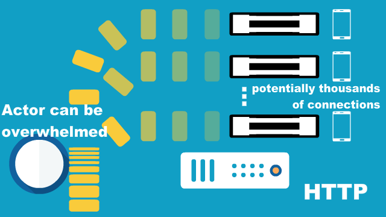
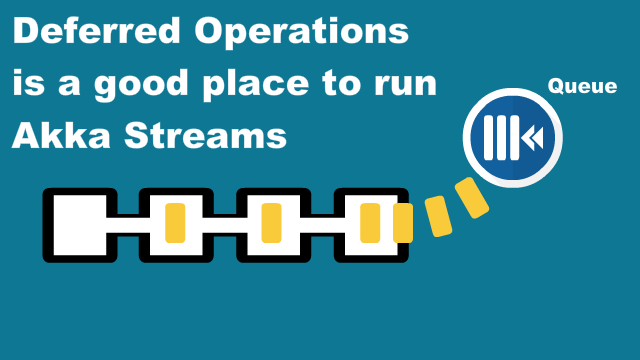
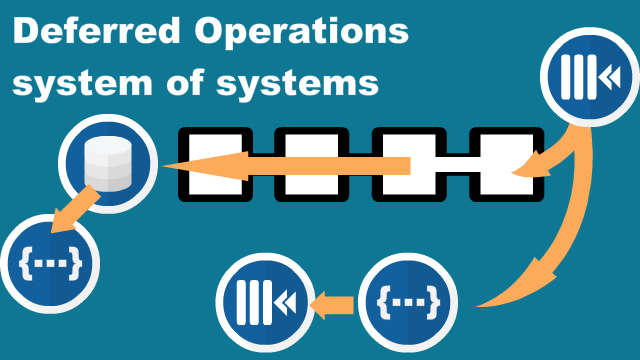

If you are new to writing an HTTP server application in Akka HTTP, you might wonder how to implement the backend processing upon an HTTP request. 

I am going to give a basic guidance for this, with concepts I call as "**HTTP request/response scope operations**" and "**Deferred operations**". The terminology is something I came up, not widely used, but hopefully it becomes clear as you read through the article.

### Typical backend processing in Akka HTTP

A simplified but typical `Route` handling an HTTP request for a certain end point is like this:

```scala{6}
val specificEndPoint: Route = path("path/to/endpoint") {
  post {
    authorize(customAuthorizationLogic){ userInfo =>
      entity(as[BuyOrder]) { order =>
        val result: Future[OrderResult] =
          backendService.processOrder(order)
        complete(result)
      }
    }
  }
}
```

And the signature of `backendService.processOrder` can be:

```scala
class BackendService extends ... {
  def processOrder: Future[OrderResult] = ...
}
```

It is very common that such backend service for Akka HTTP returns `Future`, and pass that `Future` to the `complete` directive. Up to this point, there is not much to think about, but when we start implementing this `processOrder` method, there are many choices as a lot of things can result in `Future` in Scala: 

- A database persistence call
- An external service call, typicall via HTTP
- Or a persistence to messaging queue
- The akka [ask pattern](https://doc.akka.io/docs/akka/current/futures.html#use-with-actors) (`?` method) sending messages to the backend Actor(s)

The difference between "HTTP request/response scope operations" and "Deferred operations" is a key to deciding on properly implementing the backend operation.

## HTTP request/response scope operations


An HTTP request/response scope operation is performed inside the Akka HTTP Routing DSL, like `backendService.processOrder` in the earlier example. 

It is important to note that the HTTP response is sent **after** the HTTP request/response scope operation is completed.

```scala{3-4}
class BackendService extends ... {
  def processOrder: Future[OrderResult] = {
    // Only **AFTER*** everything we performed here inside the method
    // is finished, the HTTP response can be sent
  }
}
```

As the `complete` directive in Routing DSL can take `Future` as its parameter, the directive waits until the `Future` from the backend service is completed.

```scala{7}
val specificEndPoint: Route = path("path/to/endpoint") {
  post {
    authorize(customAuthorizationLogic){ userInfo =>
      entity(as[BuyOrder]) { order =>
        val result: Future[OrderResult] =
          backendService.processOrder(order)
        complete(result)
      }
    }
  }
}
```

So there is guaranteed ordering - when the client receives the HTTP response, we can safely assume the backend operations for the request were finished. This is useful if the client sends further requests, after the initial request, and the backend needs to process the further requests based on the result from the initial request processing.

Of course, ordering doesn't necessarily guarantee operation's success. So we should return an HTTP error response on an error case, and probably we also need some recovery logic upon backend service's `Future` failure.

### Caveats on the Akka ask pattern



When we invoke the Akka `?` method as the ask pattern, be careful on not overwhelming the `backendActor` with a lot of messages.

```scala{2-3}
entity(as[BuyOrder]) { order =>
  val result: Future[OrderResult] =
    (backendActor ? BuyOrder).mapTo[OrderResult]
  complete(result)
}
```

As explained in [the official doc](https://doc.akka.io/docs/akka-http/current/server-side/low-level-api.html#controlling-server-parallelism), the number of TCP connections Akka HTTP can handle is defined in `akka.http.server.max-connections` whose default is `1024`.

Akka HTTP is particularly designed to handle many connections steadily with low memry footprint, so chances are that there could be so many requests comming in at a volume spike, and if we only have one, or very low number of backend Actors, their Actor mailboxes will explode.

### Latency matters in the HTTP request/response scope operations

As we have seen, the `complete` directive waits until the `Future` completes, then after that, sends the HTTP response back to the client.

So, if we perform many operations inside the backend `Future`, the HTTP response will be delayd and that's bad for the client experience.

In such a case, we should start thinking about what I call as "deferred opertions".

However, don't jump to deferred operatoins when the latecy at an OK level. When we start doing deferred operations, we will lose guaranteed ordering like the explained above, so we need different approaches when we need ordering on certain operations.

## Deferred operations, out of the scope from HTTP request/response


Deferred operations are something that can be performed even after the HTTP response is already sent back to the client. That means that, when the client sends the next request, we have no guarantee that all the backend operation for the former request were finished.

On the other hand, since we skip some operations before sending back the HTTP response, the latency within HTTP request/response cycle can be improved.

Remember that still we can perform some operations within the HTTP request/response scope, so using deferred operations means using **the mix of request/response scope operations and deferred operations**.

When in that mixed mode, within the HTTP request/response scope, we usually put the msesages to the queue, so that the messages can be processed afterwards. Often message queue systems like Apache Kafka or RabbitMQ are used for that purpose.

### Akka Streams in deferred operations



Running Akka Streams as the deferred operations is a good idea, especially when you have a durable message queue which Akka Streams can `Source` the data from. 

As I explained [in another article](https://richardimaoka.github.io/blog/akka-http-stream-integration/), we won't be able to integrate Akka Streams inside the Akka HTTP's request/response scope, so deferred operations is a place where Akka Streams naturally fit.

If you are interested and want to explore more on Akka Streams, I highly recommend visiting the [Alpakka project site](https://developer.lightbend.com/docs/alpakka/current/), as it gives you a wide variety of connectors including Cassandra, Kafka, AWS Lambda, S3, ElasticSearch, Files, GCP Pub/Sub, and a lot, lot more!!

> https://github.com/akka/alpakka: The Alpakka project is an open source initiative to implement stream-aware, reactive, integration pipelines for Java and Scala. It is built on top of Akka Streams, and has been designed from the ground up to understand streaming natively and provide a DSL for reactive and stream-oriented programming, with built-in support for backpressure.

### Caution: Don't use Akka Actor nor Akka Persistence as a messaging queue 

When in the deferred operation mode (i.e. mix of request/response scode and deferred operations), there might be tendency to use Akka Actor as a message queue if it feels an overkill to set up a message queue like Kafka.

No, don't use Akka Actor for the message queue. Akka Actor's mailbox doesn't have durability, so when we send too many messages to it, the underlying JVM can explode and all the messages are gone. Just don't do that.

Also, even though Akka Persistence gives durability to Akka Actor, we should not use it as a messaging queue. The durability of Akka Persistence is specifically desigined to *recover Actor's internal state in case Actor stopped*. 

Its durability is guaranteed only after the messages are processed after the Persistent Actor, so if the whole JVM is down before the sent messages are processed and persisted, you still lose the messages.

### A large system of systems, with deferred operations



Using the deferred operation approach, we can set up and integrate system of systems like the above. Something similar to like big-data-kind systems you probably saw on slides at tech conferences.

In this mode, your HTTP application completely has completely different expections from the traditional "everything done in the HTTP request/response scope" mode. The HTTP client, and even the HTTP server can only expect the minimal necessary operations are completed upon sending the HTTP response, there could be delay or even failure in the deferred operations scope for the earlier requests.

## Summary

Hope this article gave you a basic idea about how to implement the backend processing logic in Akka HTTP, and typical misuse of Akka Actors with Akka HTTP. 

Of course, there is a lot, really a lot more to think about on the implementation, so once you figured out what operations you want to perform within the HTTP request/response scope, and what can be deferred, you can go ahead looking at specific technologies like DB products, Kafka, etc to compose your whole backend. Maybe there is nothing to defer for you and everything in backend processing is in the HTTP request/response scope, and that that makes your system a lot easy to work with.