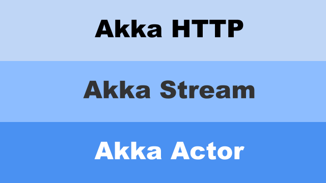

## Overview

Diagram of Akka http server -> NO!!
or animation?


## Goals of this article

- don't need users to download anything to see how things work in a high-level
- but show code that represents typical akka-http idoms, and their results

## body

```
libraryDependencies ++= Seq(
  "com.typesafe.akka" %% "akka-http"   % "10.1.3",
  "com.typesafe.akka" %% "akka-stream" % "2.5.12",
)
```

```scala
object Main {
  def main(args: Array[String]): Unit = {

    // ... application code goes here

  }
}
```

<p align="center">
  
</p>

```scala
import akka.actor.ActorSystem
import akka.stream.ActorMaterializer

implicit val system = ActorSystem("Main")       // for Akka Actor
implicit val materializer = ActorMaterializer() // for Akka Stream
```

define below. will see how `Route` works later.

```scala
// Importing Directives._ makes `get` and `complete` avaialable
import akka.http.scaladsl.server.Directives._ 
import akka.http.scaladsl.server.Route

lazy val routes: Route = get {
  complete("Hello World")
}
```

```scala
import akka.http.scaladsl.Http
Http().bindAndHandle(routes, "localhost", 8080)
```

```
> sbt run

[info] Running com.example.Main
Server online at http://localhost:8080/
```

screencapture of sbt dialog, then transition to...
screencapture of browser, showing hello world

# JSON to/from Scala case class conversion

```scala{4,5}
libraryDependencies ++= Seq(
  "com.typesafe.akka" %% "akka-http"   % "10.1.3",
  "com.typesafe.akka" %% "akka-stream" % "2.5.12",
  "com.typesafe.akka" %% "akka-http-spray-json" % "10.1.3",
  "io.spray" %%  "spray-json" % "1.3.4"
)
```    

case-class vs. json natural interpretation picture

```scala
case class User(
  name: String,
  age:  Int
)

User(name = "Richard Imaoka", age = 150)
```

```json
{
  "name": "Richard Imaoka",
  "age": 150
}
```

```scala
//importing DefaultJsonProtocol._ makes `jsonFormat2` available
import spray.json.DefaultJsonProtocol._ 
import spray.json.RootJsonFormat

case class User(name: String, age: Int)

object User {
  // formats for unmarshalling and marshalling
  implicit val userJsonFormat: RootJsonFormat = jsonFormat2(User.apply)
}
```

puzzle of implicits, picture

doing JSON <-> case class, field-by-field conversion is not enough,
as Akka HTTP has all well typed HTTP models. So it doesn't return JSON type to the client, but it needs to be HttpResponse, holding ResponseEntity inside. How does this happen? Akka HTTP and Spray JSON takes care of it.

key point, reduce boilorplate json <-> object transformation code,
but detail will be in separate article

```scala{1-2,5}
import akka.http.scaladsl.marshallers.sprayjson.SprayJsonSupport._
import com.example.model.User

lazy val routes: Route = get {
  complete(User("Joh Don", 35))
}
```

```
> sbt run
```

screenshot of browser, showing JSON


```scala{5-10,15,20}
//importing DefaultJsonProtocol._ makes `jsonFormat2`, `jsonFormat4` available
import spray.json.DefaultJsonProtocol._ 
import spray.json.RootJsonFormat

case class Address(
  zip:    Int,
  street: String,
  city:   String,
  state:  String,
)

case class EnrichedUser(
  name:    String,
  age:     Int,
  address: Address //nested case class
)

object User {
  // formats for unmarshalling and marshalling
  implicit val addressJsonFormat: RootJsonFormat = jsonFormat4(Address.apply)
  implicit val userJsonFormat: RootJsonFormat = jsonFormat2(User.apply)
}
```

```scala{6-15}
import akka.http.scaladsl.marshallers.sprayjson.SprayJsonSupport._
import com.example.model.User

lazy val routes: Route = get {
  complete(
    EnrichedUser(
      "Richard Imaoka",
      150,
      Address(
        zip = 1112222,
        street = "5-6-7 XYZ-street",
        city = "New York",
        state = "New York",
      )
    )
  )
}
```

```json{4-9}
{
  "name": "Richard Imaoka",
  "age": 150,
  "address": {
    "zip": 1112222,
    "street" : "5-6-7 XYZ-street",
    "city" : "New York",
    "state" : "New York"     
  }
}
```

screen capture of json returned

# basic route structure

```
//route structure
GET /users/person1
GET /users/person2
GET /users/person3
```

```scala{6,11}
lazy val routes: Route =
  path("person1"){
    get {
      complete(User("Joh Don", 35))
    }
  } ~
  path("person2"){
    get {
      complete(User("Justin Bieber", 24))
    }
  } ~
  path("person3"){
    get {
      complete(User("Peyton List", 20))
    }
  }
```

Screencapture of accessing /, then three paths

PUT, PATCH, etc are available
JSON -> case class is also possible
plugins for cors, etc


## low-level, needs understanding of HttpRequest and HttpResponse

Hmmmm I dunno whether you can use this with marsheller/unmarshaller ...
do not mention this in the article, or just completely omit this low-level section from this article

translate above high-level code to low level
diagram showing mapping between HTTP data structure and HttpRequest/Response
(use real fields/values for HTTP data, for easier understanding)
(and possibly real chrome screenshot)

