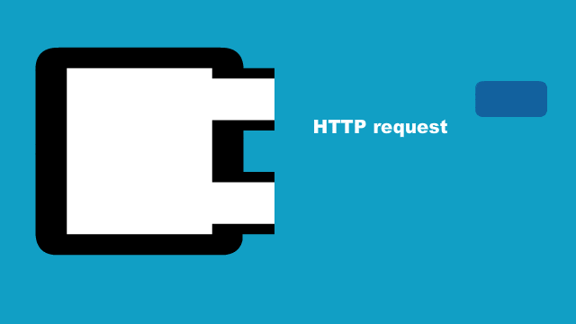
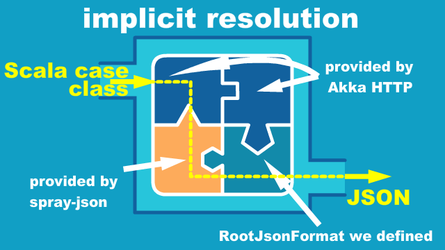
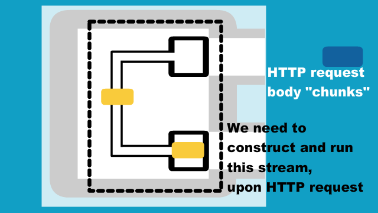
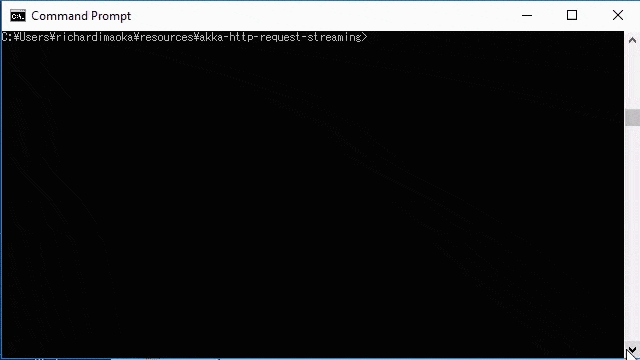
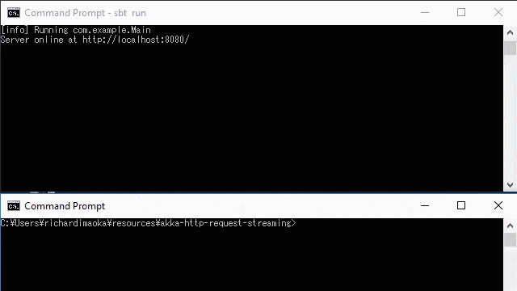

In the previous article, [Akka HTTP response streaming](../akka-http-response-streaming)), I covered HTTP response streaming to send chunk-by-chunk HTTP body to the client.

Then I am going to introduce the oppsite of that, which is HTTP **request** streaming, which is als described in the official Akka HTTP doc on the [Consuming JSON Streaming uploads](https://doc.akka.io/docs/akka-http/current/routing-dsl/source-streaming-support.html#consuming-json-streaming-uploads) section. 

For thoese who are interested, [full source code is available here, with instruction to run the example](https://github.com/richardimaoka/resources/tree/master/akka-http-request-streaming)




## The `asSourceOf` directive

In Akka HTTP [Routing DSL](https://doc.akka.io/docs/akka-http/current/routing-dsl/index.html#routing-dsl), there is a convenient directive for HTTP request streaming, which is `asSourceOf`.

```scala{2}
def route(): Route = post {
  entity(asSourceOf[DataChunk]) { source => //Source[DataChunk]
    val result: Future[String] = ...
    complete(result)
  }
}
```

Also, to let the `asSourceOf` directive work, we will need to define an `implicit` instance of `akka.http.scaladsl.common.EntityStreamingSupport` like we did for response streaming. If the `implicit` instance is missing, the Scala compiler will give you an error.

## Define the data model for the JSON chunk

Next, we should define a data model for a JSON chunk, as a Scala case class. For simplicity, we use this `DataChunk` definition, 

```scala
case class DataChunk(id: Int, data: String)
```

along with the `implicit` instance of `RootJsonFormat[DataChunk]`.

```scala
import spray.json.DefaultJsonProtocol._
import spray.json.RootJsonFormat

object DataChunk {
  implicit val dataChunkJsonFormat: RootJsonFormat[DataChunk]
    = jsonFormat2(DataChunk.apply)
}
```

This `implicit` instance will be a piece of implicit resolution "puzzle" along with `akka.http.scaladsl.common.EntityStreamingSupport` and other `implicit` instances with Akka HTTP and spray-json provides.




## Construct the stream to run, upon each HTTP request

Now the data model for the JSON chunk is done, we should start coding the stream which runs upon arrival of each HTTP request.



As we have seen earlier, this `asSourceOf` directive:

```scala
entity(asSourceOf[DataChunk]) { source => //Source[DataChunk, NotUsed]
```

extracts an Akka Stream `Source[DataChunk, NotUsed]`, that should be connected to the rest of the stream and run. Just for the sake of simplicity, let's define the following stream, which just counts the number of elements (i.e. number of chunks) within the HTTP request.

```scala
val initialCount = 0
val countElement =
  (currentCount: Int, _: DataChunk) => currentCount + 1

source //Source[DataChunk]
  .log("received").withAttributes(
    Attributes.logLevels(onElement = Logging.InfoLevel))
  // count the number of elements (chunks)
  .runFold(initialCount)(countElement)
  // map the materialized value
  .map{ count => s"You sent $count chunks" }
```      

### Step-by-step description about the stream example

For those who can quickly understand what the above stream does, please skip this section. Otherwise, let me explain it a bit.

I'll demonstrate this entire example in action bit later, but we should expect this source:

```scala
source //Source[DataChunk]
```

emits chunks like below:

```
// HTTP request body as JSON
// note that comments are only display purpose, as JSON doesn't allow comments
[
  {"id": 1, "data": "the first"  }, //1st chunk
  {"id": 2, "data": "the second" }, //2nd chunk
  {"id": 3, "data": "the third"  }, //...
  {"id": 4, "data": "the fourth" },
  {"id": 5, "data": "the fifth"  },
  {"id": 6, "data": "the sixth"  }
]
```

although each chunk is converted from a JSON object to a Scala case class instance of `DataChunk` we defined earlier.

Then this piece of operator is just for showing a log message upon each element goes through this step.

```scala
.log("received").withAttributes(
  Attributes.logLevels(onElement = Logging.InfoLevel))
```

The next step is this `runFold`:

```scala
val initialCount = 0
val countElement =
  (currentCount: Int, _: DataChunk) => currentCount + 1

...
.runFold(initialCount)(countElement)
```

`source. ... .runFold(initialCount)(countElement)` is the Akka Stream version of the `fold(Left)` operation, and that will result result in (i.e. **materialize** to) `6: Future[Int]`.

Since the `complete` Akka HTTP directive does not take `Future[Int]` as the parameter, we convert it to `Future[String]`.

```scala
// map the materialized value
.map{ count => s"You sent $count chunks" }
```

---
**NOTE**: If you cannot tell what the above `runFold` does and are not familiar with Scala's `fold` family of methods, you can see how this can be compared to the case of plain `List`.

```scala
> sbt console

> import com.example.DataChunk 

> val list = List(
  DataChunk(1, "the first"),  
  DataChunk(2, "the second"),  
  DataChunk(3, "the thrid"),  
  DataChunk(4, "the fourth"),  
  DataChunk(5, "the fifth"),  
  DataChunk(6, "the sixth"),  
)

> val initialCount = 0
> val countElement =
  (currentCount: Int, _: DataChunk) => currentCount + 1

> list.foldLeft(initialCount)(countElement)
//you will get `res0: Int = 6`
```

If you have, [ downloaded the source code](https://github.com/richardimaoka/resources/tree/master/akka-http-request-streaming), you can exacute this from an `sbt console` REPL session.



Hope this gave you the understanding of what `runFold` does above.

---

## Run the stream from `Route`, and integrate everything

Now that we defined the stream to run upon each HTTP request, we wrap the stream definition into a class which has a method to take the `Source` and run:

```scala{1-19,32}
import akka.NotUsed
import akka.actor.ActorSystem
import akka.event.Logging
import akka.stream.scaladsl.Source
import akka.stream.{Attributes, Materializer}

import scala.concurrent.{ExecutionContext, Future}

class DataProcessor(
  implicit
  system: ActorSystem, //this is just for implicit ExecutionContext below
  materializer: Materializer
) {
  def runDataSource(
    source: Source[DataChunk, NotUsed]
  ): Future[String] = {
    // This is needed for the last `map` method execution
    implicit val ec: ExecutionContext = system.dispatcher

    val initialCount = 0
    val countElement =
      (currentCount: Int, _: DataChunk) => currentCount + 1

    source
      .log("received").withAttributes(
        Attributes.logLevels(onElement = Logging.InfoLevel))
      // count the number of elements (chunks)
      .runFold(initialCount)(countElement)
      // map the materialized value
      .map{ count => s"You sent $count chunks" }
  }
}
```

Note that the above required an `implicit Materializer` so that the stream can be run inside. The `implicit ActorSystem` is just for `ExecutionContext`, required for the last `map` method on the stream.

The complete code for the `Route` is as follows. Note the constructor of `MainRoute` below requires the `dataProcessor: DataProcessor` parameter, and the `implicit` instance of `jsonStreamingSupport: JsonEntityStreamingSupport` is defined.

```scala{1-14,18,23}
package com.example

import akka.http.scaladsl.common.{EntityStreamingSupport, JsonEntityStreamingSupport}
import akka.http.scaladsl.marshallers.sprayjson.SprayJsonSupport._
import akka.http.scaladsl.server.Directives._
import akka.http.scaladsl.server.Route
import com.example.DataChunk._

import scala.concurrent.Future

class MainRoute(dataProcessor: DataProcessor) {
  implicit val jsonStreamingSupport: JsonEntityStreamingSupport =
    EntityStreamingSupport.json()

  def route(): Route = post {
    entity(asSourceOf[DataChunk]) { source => //Source[DataChunk]
      val result: Future[String] =
        dataProcessor.runDataSource(source)

      complete(result)
    }
  }
}
```

Lastly, the `Main` object is here, which passes in the `DataProcessor` instance to the route, and `implicit`ly passes in the `ActorSystem` and `ActorMaterializer` to `DataProcessor`:

```scala{10}
import akka.actor.ActorSystem
import akka.http.scaladsl.Http
import akka.stream.ActorMaterializer

object Main {
  def main(args: Array[String]): Unit = {
    implicit val system: ActorSystem = ActorSystem("Main")
    implicit val materializer: ActorMaterializer = ActorMaterializer()

    val dataProcessor = new DataProcessor
    val mainRoute = new MainRoute(dataProcessor)

    Http().bindAndHandle(mainRoute.route, "localhost", 8080)
    println(s"Server online at http://localhost:8080/")
  }
}
```

If you run this example, you can see that each elements on the server side is logged due to the `log` operator in the stram, as on the upper window in the below demo.



The bottom window of the below demo is the curl command, which is below:

```
curl
  -X POST \
  -H "Content-type: application/json" \
  -H "Transfer-Encoding: chunked" \
  -d "@request.json" http://localhost:8080
```

where the `request.json` file is this:

```
[
  {"id": 1, "data": "the first"  },
  {"id": 2, "data": "the second" },
  {"id": 3, "data": "the third"  },
  {"id": 4, "data": "the fourth" },
  {"id": 5, "data": "the fifth"  },
  {"id": 6, "data": "the sixth"  }
]
```

Again, [the full source code is available here, with instruction to run the example](https://github.com/richardimaoka/resources/tree/master/akka-http-request-streaming). So if you want to see all the details, plase have a look.