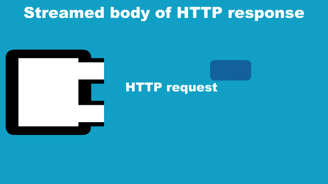
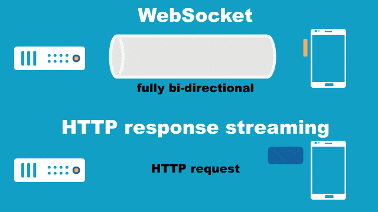
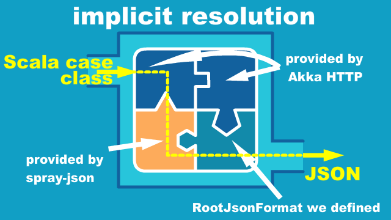

In this article, I am going to introduce HTTP response streaming, which is also described in the official Akka HTTP doc on the [Source Streaming/JSON streaming page](https://doc.akka.io/docs/akka-http/current/routing-dsl/source-streaming-support.html#source-streaming). 

For thoese who are interested, [full source code is available here](https://github.com/richardimaoka/resources/tree/master/akka-http-response-streaming), with instruction to run the example.

There are common use cases where such HTTP response streaming is useful, for example:

1. The client GUI application immediately processes every small chunk of data as soon as received, for quicker rendering
2. The HTTP server sends a huge amount of data in a back-pressured fashion so that the client is not overwhelmed

For 1, [Oboe.js](http://oboejs.com/) seems to be a good example. It has nice features and also graet animation on its website illustrating its capabilities, so I would highly recommend visiting the [Oboe.js site](http://oboejs.com/) .

<a href="http://oboejs.com/">
  
</a>

### HTTP request without vs. with streaming

You might wonder that HTTP response streaming is not useful, if the HTTP server can respond with a small but complete HTTP request upon each of frequent HTTP requests, which is illustrated as "HTTP response without streaming" in the below animation. 


That might work in some cases, but if the latency is large between the client and the server, you can get throughput benefit with only a single request then returning multiple chunks by HTTP response streaming, because the client doesn't need the second and following requests before receiving more chunks. 

### WebSocket vs. HTTP request streaming

You might also think that WebSocket can do the same thing, and yes, in certain cases you can achieve the same goals using WebSocket. 

However, they are just differnt things that can be used for different purposes, even if there could be some overlap in the use cases. WebSocket is bi-directional connectivity based on its own protocol, but HTTP response streaming happens within a single HTTP request/response roundtrip, and it is Akka HTTP's implementation of HTTP Chunked Transfer Encoding [RFC7230 section 4.1](https://tools.ietf.org/html/rfc7230#section-4.1).

 

WebSocket and HTTP streaming are not competing techniques nor replacement to each other in general, and you should choose the appropriate one dependent on your use case and your expected application behavior.

If the simplicity in HTTP response streaming's prefered (i.e.) it happens inside a single HTTP request/response roundtrip, you would go with HTTP response streaming. If you need more flexible bi-directional connectoin, WebSocket might be a better fit.

## How to implement HTTP response streaming

From here, let's see how to implement the JSON streaming with an example as illustrated in the following demo screen recording. [The complete source code can be found here](https://github.com/richardimaoka/resources/tree/master/akka-http-response-streaming) with instruction to run the example.

More detailed explanation can be found in [the official doc](https://doc.akka.io/docs/akka-http/current/routing-dsl/source-streaming-support.html#json-streaming).

 

Firstly make sure the following dependencies are in your `build.sbt`.

```
libraryDependencies ++= Seq(
  "com.typesafe.akka" %% "akka-http"   % "10.1.3",
  "com.typesafe.akka" %% "akka-stream" % "2.5.12"
)
```

Then, we should define the case class modeling the chunk of JSON data in a Scala case class.

```scala
case class DataChunk(id: Int, data: String)
```

The next thing is to define `implicit` instances of necessary type classes so that "Scala case class to JSON" conversion happens automatically. (If you forget necessary `implicit` instances, the Scala compiler gives you an error.)  

So, add these to the `libraryDependencies`.

```scala{4,5}
libraryDependencies ++= Seq(
  "com.typesafe.akka" %% "akka-http"   % "10.1.3",
  "com.typesafe.akka" %% "akka-stream" % "2.5.12",
  "com.typesafe.akka" %% "akka-http-spray-json" % "10.1.3",
  "io.spray" %%  "spray-json" % "1.3.4"
)
```    

Here we use [spray-json](https://github.com/spray/spray-json), as in the [JSON to/from Scala case class conversion](../akka-http-quickstart) section of my article, and the [Routing DSL for HTTP servers](https://doc.akka.io/docs/akka-http/current/introduction.html#routing-dsl-for-http-servers) section in the official doc.

We should define the following `implicit RootJsonFormat[DataChunk]` instance.

```scala
import spray.json.DefaultJsonProtocol._
import spray.json.RootJsonFormat

object DataChunk {
  implicit val dataChunkJsonFormat: RootJsonFormat[DataChunk]
    = jsonFormat2(DataChunk.apply)
}
```

This `implicit RootJsonFormat[DataChunk]` will fit into the `implicit` resolution puzzle with the pieces provided by Akka HTTP and spray-json.

 

We need some more `implicit` instances to import, and specifically for HTTP response streaming, an `implicit` instance of `EntityStreamingSupport` should be defined:

```scala{1-2,5,8-9}
import akka.http.scaladsl.common.{EntityStreamingSupport, JsonEntityStreamingSupport}
import akka.http.scaladsl.marshallers.sprayjson.SprayJsonSupport._
import akka.http.scaladsl.server.Directives._
import akka.http.scaladsl.server.Route
import com.example.DataChunk._

// this is needed for HTTP response streaming
implicit val jsonStreamingSupport: JsonEntityStreamingSupport
  = EntityStreamingSupport.json()

def route: Route = get {
  complete(DataSource.source)
}
```

where `DataSource.source` is:

```scala
import akka.NotUsed
import akka.stream.scaladsl.Source
import scala.concurrent.duration._

object DataSource {
  def source: Source[DataChunk, NotUsed] =
    Source(List(
      DataChunk(1, "the first"),
      DataChunk(2, "the second"),
      DataChunk(3, "the thrid"),
      DataChunk(4, "the fourth"),
      DataChunk(5, "the fifth"),
      DataChunk(6, "the sixth"))
      // you need throttling for demonstration, otherwise
      // it's too fast and you don't see what's happening
    ).throttle(1, 1.second)
}
```

The highlighted lines above will make the implicit resolution passes and compilation will go through. 

Previously, `EntityStreamingSupport` was not needed as in the [quickstart article](../akka-http-quickstart/) because it just `complete`-d the HTTP response with a instant value. Now HTTP response streaming uses `Source` passed to the `complete` method, not just a simple instant value, thus the `implicit EntityStreamingSupport` instance is needed.

Now you can bring up the HTTP server from the main method,

```scala
import akka.actor.ActorSystem
import akka.http.scaladsl.Http
import akka.stream.ActorMaterializer

object Main {
  def main(args: Array[String]): Unit = {
    implicit val system: ActorSystem = ActorSystem("Main")
    implicit val materializer: ActorMaterializer = ActorMaterializer()

    Http().bindAndHandle(route, "localhost", 8080)
    println(s"Server online at http://localhost:8080/")
  }
}
```

and just run it.

```
> sbt run
```

If you access http://localhost:8080, you will see the following

```
[{"id": 1, "data": "the first"},{"id": 2, "data": "the second"},{"id": 3, "data": "the third"},{"id": 4, "data": "the fourth"},{"id": 5, "data": "the fifth"},{"id": 6, "data": "the sixth"}]
```

Not that the end result is a complete JSON array, where each JSON data chunk is a JSON object, delimited by `,`. This can be compared with new-line delimited JSON streaming, as described in the following section.

## New-line delimited JSON streaming

JSON streaming actually doesn't have the single fixed format, but another major variant from the above comma-delimited JSON streaming is new-line delimited JSON streaming.

That is illustrated as follows, and you will notice that the end result is not a valid JSON, but only each data chunk is a valid JSON object, delimited by new-lines instead of commas.

 

 If for any reason new-line delimited JSON streaming is preferred, you can do that by changing the `EntityStreamingSupport` as follows:


```scala{4-9}
implicit val jsonStreamingSupport: JsonEntityStreamingSupport =
  EntityStreamingSupport
    .json()
    // comment out the lines below to comma-delimited JSON streaming
    .withFramingRenderer(
      // this enables new-line delimited JSON streaming
      Flow[ByteString].map(byteString => byteString ++ newline)
    )

def route: Route = get {
  complete(DataSource.source)
}
```


Again, if you want to see the complete source code, that can be found [here](https://github.com/richardimaoka/resources/tree/master/akka-http-response-streaming) with instruction to run the example.