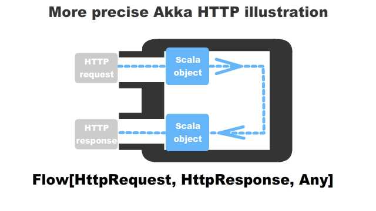
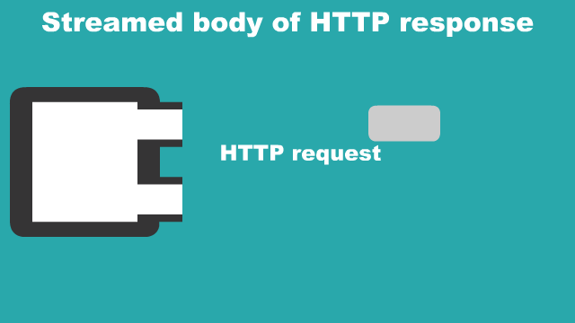

As I started writing [articles about Akka HTTP](), I just wondered whether Akka HTTP integrates with Akka Stream like this - plug in my own `Flow` into the stream of Akka HTTP:


After looking through the official doc, I found no section talking about integration like that, and in the end of long search in google, I encountered this [Stack Overflow entry](https://stackoverflow.com/questions/36294428/akka-http-complete-request-with-flow) 
> maybe the only way is to wire and materialize a new flow (upon each HttpRequest)

**Really**?

Really. It turned out that the Stack Overflow answer was correct - **we cannot do what is in the above diagram**, and I will explain why.

## The requirement:

First of all, why did I want the integration in that way? What was the nice thing about it?

The reason was this; We might have **existing busines logic** implemented in Akka Stream, leveraging its nice features like throttling, logging, etc. 

Also implementing the business logic in Akka Stream gives you a declarative explanation of the logic.

```scala
// Akka stream code as explanation of the steps
source
  .throttling(5, 1.second) //5 elements per second
  .mapAsync(externalService)
  .via(validateServiceResult)
  .via(transformServiceResult)
  .mapAsync(reporMetricService)
  .log()
  .to(databaseSink)
```

This is much easier to trace down to the actual processing step, see the relationship between two consecutive steps in the stream, **compared to** debugging the business logic consisting of **only Akka actors**.

With those advantages of Akka Stream, I felt it's natural to think of integration with Akka HTTP.

### Why the integration doesn't work in that way ...

However, the integration as in the previous diagram does not work. By looking at the signature of the `bindAndHandle` method, which is to bring up an HTTP server instance, it becomes clearer. 

```scala{2}
def bindAndHandle(
  handler:   Flow[HttpRequest, HttpResponse, Any],
  interface: String, port: Int = DefaultPortForProtocol,
  connectionContext: ConnectionContext = defaultServerHttpContext,
  settings:          ServerSettings    = ServerSettings(system),
  log:               LoggingAdapter    = system.log)(
  implicit fm: Materializer
): Future[ServerBinding] = ...
```
The important part is the 2nd line, `Flow[HttpRequest, HttpResponse, Any]`. 

Upon the start of an HTTP server, the `bindAndHandle` method takes this `Flow` as a parameter and this `Flow[HttpRequest, HttpResponse, Any]` is a single processing step which **cannot be divided into two**, `Flow[HttpRequest, T, _]` and `Flow[U, HttpResponse, _]`. So the diagram I pasted earlier was incorerct, and more accurate one is like this:



## Coming back to the requirement - did we really need that in the first place?

My seemingly simple idea, turned out to be impossible. So, there must be something I was missing - if this is a natural requirement most people would want, then Akka HTTP API must have already allowed this. However, no one seems to have complained about it, although Akka HTTP has been ther for few years and been already stable. This leads me to a conclusion that what I was thinking was not very useful.

Let's come back to the requirement then - do we really want to integrate Akka Stream, well more precisely, **existing business logic as** `Flow` into Akka HTTP's `Flow[HttpRequest, HttpResponse, Any]`?

**Probably not**. We can describe the business logic in plain Scala code, a chain of method executions, rather than Akka Stram.

The first reason why this is not needed is that, although I find Akka Stream's DSL makes it easy to understand the whole chain of processing steps, it is **only easier in comparison to a chain of Akka Actors**. When using plain Scala code, method invoking chains could be easier, or as easy as Akka Stream to read.

```scala
// Akka stream code as explanation of the steps
source
  .throttling(5, 1.second) //5 elements per second
  .mapAsync(externalService)
  .via(validateServiceResult)
  .via(transformServiceResult)
  .mapAsync(reporMetricService)
  .log()
  .to(persistDatabaseSink)
```

```scala
// vs. plain method invocation chain, (e.g. using for comprehension)
def externalService(input: Input): Future[Data] = ..
def validateServiceResult(data: Data): Boolean = ...
def transformServiceResult(data: Data): TransformedData = ...
def reportMetricService(data: TransformedData): Future[Unit] = ...
def persistDatabase(data: TransformedData): Future[TransformedData] = ...

for {
  data <- externalService(input)
  if (validateServiceResult(data))
  transformed = transformServiceResult(data)
  _ <- reportMetricService(transformed)
  _ <- persistDatabase(transformed)
} yield {
  log(...)
  transformed
}
```

Another reason is that since [HTTP pipelining](https://en.wikipedia.org/wiki/HTTP_pipelining) is generally [discouraged](https://doc.akka.io/docs/akka-http/current/server-side/low-level-api.html#controlling-server-parallelism), `Flow[HttpRequest, HttpResponse, Any]` waits until the HTTP response is consumed, before processing the next HTTP request.
This would make many of flow-control operators like `throttle`, `buffer`, etc not needed. 


The third and the last reason I found was, although plugging in `Flow` is not possible, but plugging in `Source` is possible as described [here in the official doc](https://doc.akka.io/docs/akka-http/current/routing-dsl/source-streaming-support.html#source-streaming). So there are ways to control the throughput of your stream **in a single HTTP request/response roundtrip**, as long as we implement `Source` not `Flow`.



Here I've covered my findings about Akka HTTP and Akka Stream integration. Hope this is useful for people who were thinking about similar integration ideas like mine. Also let me know if anyone finds what I was missing to discuss in the article.
