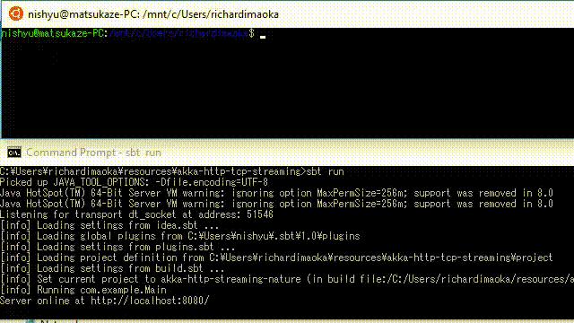

Akka HTTP server is implemented in a way using streams, all the way from the TCP layer through HTTP, up to your application layer. In this short article, I am going to cover how TCP streaming works in Akka HTTP.


The above animation illustrates streaming at the TCP layer. Firstly, each incoming connection, triggers a creation of `Tcp.IncomingConnection` which essentially represents `Flow[ByteString, ByteString]` in Akka Streams. And within each TCP connection, data bytes in `ByteString` are streamed through the connection.

## Handling many connections with fewer threads

By this design, an Akka HTTP server does not need to hold a dedicated thread for each TCP connection. To see this in action, let me do some experiment.

By default, Akka HTTP accepts up to 1024 open TCP connections, and the limit can be configured by the `akka.http.host-connection-pool.max-connections` config value.

Let's use an HTTP benchmark client [wrk](https://github.com/wg/wrk) as follows:

```
$ wrk -t6 -c1200  -d30s http://localhost:8080
```

This wrk command means
- `-t6 : it uses 6 benchmark client threads`,
- `-c1200: 1,200 open connections` and
- `-d30s: runs benchmark for 30 seconds`.

The result is here, where I shortend the vide duration a bit from 30 seconds.



I forcefully inserted `println` so show the active TCP connections and it says it opened 1016, not 1024. This was due to some connections errors, and indeed errors were included in the below result. Maybe wrk was too fast (indeed, it is super fast!) and caused connection failure.

```
Running 30s test @ http://localhost:8080

  6 threads and 1200 connections
  Thread Stats   Avg      Stdev     Max   +/- Stdev
    Latency    20.42ms   10.49ms 484.06ms   95.94%
    Req/Sec     7.92k     1.57k   11.90k    91.37%

  1400416 requests in 30.04s, 205.67MB read
  Socket errors: connect 185, read 0, write 649, timeout 0

Requests/sec:  46619.78
Transfer/sec:      6.85MB
```

Anyway, see the below screenshot of VisualVM. Main-akka.actor.default-dispatcher-XX are threads serving underlying actors for Akka HTTP. There were only about 30 threads, although the HTTP server had more than 1000 connections open at the time.

