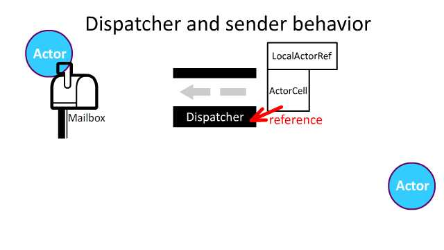
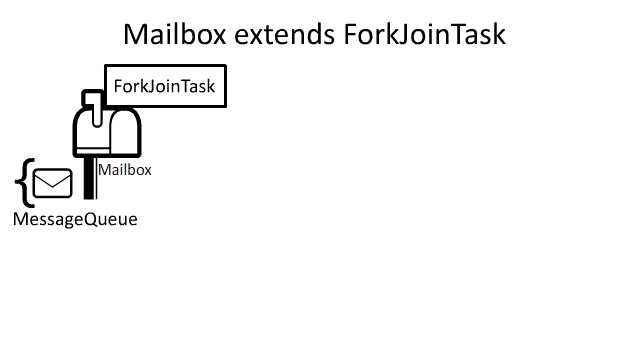
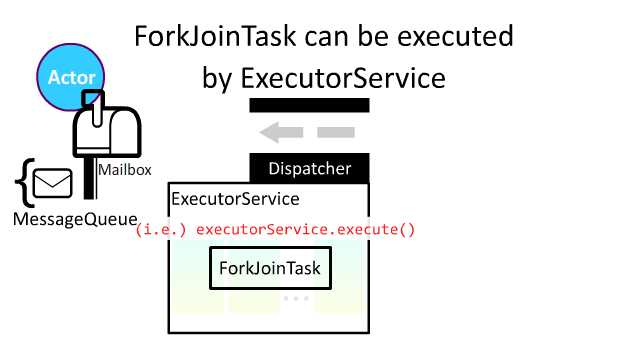
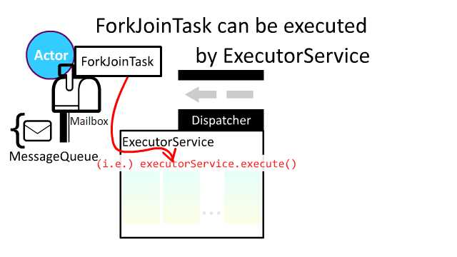
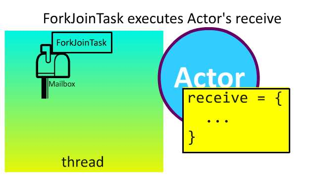

## Overview

<iframe width="640" height="360" src="https://www.youtube.com/embed/0tDFep0hOSI" frameborder="0" allow="autoplay; encrypted-media" allowfullscreen></iframe>

The concept of Akka [`Dispatcher`](https://doc.akka.io/docs/akka/2.5/dispatchers.html?language=scala) might be unfamiliar to you and it is probably difficult to understand. So I am going to explain how Dispatcher works in detail here.

## Meaning of "dispatch"

If you look up the meaning of the word "dispatch" in a dictionary, you would find it is almost same as "send". In akka, `Dispatcher` is, yes, what sends messages, but something more than that.

## Dispatcher and Actor relationship


Firstly, `Dispatcher` is configured for `ActorSystem`, typically in `application.conf`. There is at least default one, and you can [also configure multiple `Dispatcher`s](https://doc.akka.io/docs/akka/current/dispatchers.html#dispatchers).

```scala
val system = ActorSystem("exampleSystem")
system.dispatchers.lookup("my-dispatcher")
```

As a rule of thumb, the `Dispatcher` instance for the given name is created when the [`lookup` method of `ActorSystem`](https://github.com/akka/akka/blob/v2.5.9/akka-actor/src/main/scala/akka/dispatch/Dispatchers.scala#L79) is called for the first time. You don't normally call it yourself, but this lookup is done by akka. Another thing is the default `Dispatcher` is already created upon `ActorSystem` initialization, as it calls `lookup` for the default internally.

```scala
/**
* Returns a dispatcher as specified in configuration. Please note that this
* method _may_ create and return a NEW dispatcher, _every_ call.
*
* Throws ConfigurationException if the specified dispatcher cannot be found in the configuration.
*/
def lookup(id: String): MessageDispatcher = lookupConfigurator(id).dispatcher()

```  


`Dispatcher` is NOT part of `Actor`. One `Dispatcher` can send messages to multiple `Actor`s. (NOTE: `Dispatcher` doesn't have routing capabilities. Routing is done by akka [`Router`](https://doc.akka.io/docs/akka/2.5/routing.html#routing))

## Dispatcher and ExecutorService


`Dispatcher` has `ExecutorService`, and `ExecutorService` is like a pool of threads where you can execute code (`Runnable`) concurrently. See [Executor/ExecutorService in Java, and ExecutionContext behind Future in Scala](../executor-and-execution-context) for illustration and more details.

Here is [`executorService` method](https://github.com/akka/akka/blob/v2.5.9/akka-actor/src/main/scala/akka/dispatch/Dispatcher.scala#L47) of `Dispatcher`.

```scala
def executorService: ExecutorServiceDelegate = ...
```

The pool of threads from `ExecutorService` is what invokes `Actor`'s `receive` method, which will be explained later in this article.

## Dispatcher and sender-side behavior



Part of below is reharsing what was already discussed in [Local Actor workflow part 1 - Sender side](../local-minimal-sender), but here more from the `Dispatcher` perspective. 

(For remoting, there are several more steps to go through but it is combination of local message-passing and network via Netty, as discussed in [remoting articles](../remote-minimal-sender))

`LocalActorRef` is [coupled with `ActorCell`](https://github.com/akka/akka/blob/v2.5.9/akka-actor/src/main/scala/akka/actor/ActorRef.scala#L319), which is hidden from users as private and it is implementation details of how akka messaging works.

```scala
class LocalActorRef(...)
 extends ActorRefWithCell
 with LocalRef  {
  ...
  val actorCell: ActorCell = ...
  ...
}
```

[As you see below](), `ActorCell` has a reference to `Dispatcher` (`val dispatcher:  MessageDispatcher`).

```scala
class ActorCell(
  ...
  val dispatcher:  MessageDispatcher,
  ...
  ) extends ...
  ...
  with dungeon.Dispatch {
    ...
  }
```

So when you do `actorRef ! "hello"`, that `actorRef` (whose type is `LocalActorRef`) already knows what `Dispatcher` to use via [`ActorCell`](https://github.com/akka/akka/blob/v2.5.9/akka-actor/src/main/scala/akka/actor/ActorCell.scala#L370).


Also `ActorCell` extends [`Dispatch` trait](https://github.com/akka/akka/blob/v2.5.9/akka-actor/src/main/scala/akka/actor/dungeon/Dispatch.scala#L27) and it has a refence to `Mailbox`, so `LocalActorRef` also knows which `Mailbox` to send the massage, via `ActorCell`. 

```scala
trait Dispatch { this: ActorCell ⇒
  ...
  def mailbox: Mailbox = ...
  ...
}
```

This couping of `LocalActorRef`, `ActorCell`, and `Mailbox` is what I meant by `Dispatcher` doesn't have routing capabilities in a "NOTE" earlier.


`Dispatcher`'s [dispatch](https://github.com/akka/akka/blob/v2.5.9/akka-actor/src/main/scala/akka/dispatch/Dispatcher.scala#L52L56) method is as follows:


```scala
def dispatch(
  receiver: ActorCell,
  invocation: Envelope
): Unit = {
  val mbox = receiver.mailbox
  mbox.enqueue(receiver.self, invocation)
  registerForExecution(mbox, true, false)
}
```

where [registerForExecution](https://github.com/akka/akka/blob/v2.5.9/akka-actor/src/main/scala/akka/dispatch/Dispatcher.scala#L115) is:

```scala
def registerForExecution(mbox: Mailbox, ...): Boolean = {
  ...
  executorService execute mbox
  ...
}
```

In the above code, `Dispatcher`'s `excutorService` is executing `mbox: Mailbox`, because [`Mailbox`](https://github.com/akka/akka/blob/v2.5.9/akka-actor/src/main/scala/akka/dispatch/Mailbox.scala#L56L57) extends `ForkJoinTask`, which can be `execute`-d by `ExecutorService`.





```scala
abstract class Mailbox(val messageQueue: MessageQueue)
  extends ForkJoinTask[Unit] 
  with SystemMessageQueue 
  with Runnable {
    ...
}
```

Execution (i.e. processing) of `Mailbox` is run on a different `Thread`, which was covered in [Local Actor workflow part 2 - Receiver side](../local-minimal-receiver)

## Dispatcher and receiver-side behavior



When `run` method of `ForkJoinTask` is executed, the [following method of `Mailbox`](https://github.com/akka/akka/blob/v2.5.9/akka-actor/src/main/scala/akka/dispatch/Mailbox.scala#L250) is called, 

```scala
@tailrec private final def processMailbox(
  ...
  // def dequeue(): Envelope = messageQueue.dequeue()
  val next = dequeue() 
  ...
  actor invoke next
  ...
  processMailbox(...)
}
```

it picks up a message from the message queue, and process it.



So this `processMailbox` method, called from `ForkJoinTask`'s `run` is what invokes your `receive` method you defined in your `Actor`.

```scala
class MyActor extends Actor {
  def receive = {
    ...  
  }  
}
```
