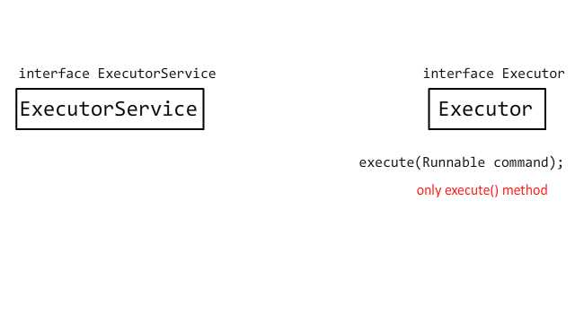
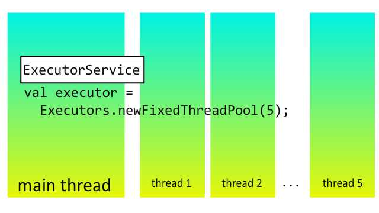
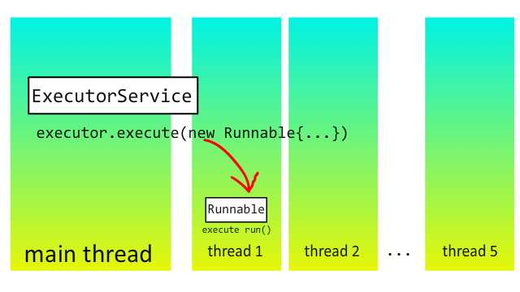
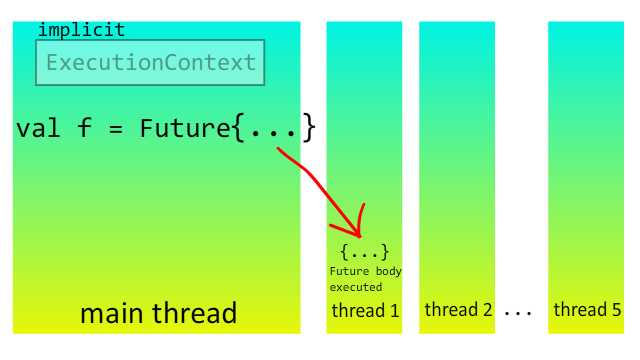

## Overview

You can find the code and instruction to run the example at [GitHub](https://github.com/richardimaoka/resources/tree/master/executor-and-execution-context).

<iframe width="640" height="360" src="https://www.youtube.com/embed/zgp2B-cuUMI" frameborder="0" allow="autoplay; encrypted-media" allowfullscreen></iframe>

## Thread in Java 


`Thread` and `Runnable` has been there for long as the very first generation of concurrent execution approaches in Java. The concept and usage are rather simple, where you extend `Runnable` and implement the `run` method which represents the operation you want to execute concurrently.

(`Runnable` is from Java, but here I'm defining a Scala class extending it.)

```scala
class PrintRunnable extends Runnable {
  def run(): Unit = {
    println(s"[${Thread.currentThread()}] - PrintRunnable run() is executed")
  }
}
```


[javadoc of `Runnable`](https://docs.oracle.com/javase/8/docs/api/java/lang/Runnable.html
)

Then you instantiate a `Thread` by passing in a `Runnable` instance, and call the `start()` method.

```scala
println(s"[${Thread.currentThread()}] - main thread")
t = new Thread(new PrintRunnable(1))
t.start()
```

[javadoc of `Thread`](https://docs.oracle.com/javase/8/docs/api/java/lang/Thread.html)

Then you will get output like this. The `Thread` names are enclosed in `[]`, which show that the main thread - (i.e.) one which did `t = new Thread(new PrintRunnable(1))` - and the thread running `Runnable` are different - (i.e.) Concurrently executed.

```
[Thread[run-main-0,5,run-main-group-0]] - main thread
[Thread[pool-8-thread-1,5,run-main-group-0]] - PrintRunnable run() is executed
```

Typically after you call the `start()` method of `Thread`, you also call the `join()` method to wait until the thrad dies.

```scala
t.join()
```

## Executor and ExecutorService in Java


The next generation of Java concurrency execution approach was `Executor` and `ExecutorService`.
While `Thread` allowed you handle concurrent execution in a separate thread, but when it comes to the point where you handle many threads for many different purposes in the same application, it becomes unmanagable.

`Executor` and `ExecutorService` control `Thread` instances in the background so that you don't handle each single `Thread` by yourself, which is tedious, but rather you do higher level of control by handling a group of `Thread` instances (`ThreadPool`, which is not explained in this article though) via `ExecutorService`.

Let's look at the code - firstly `Executor` is a very simple interface which only has this single `execute` method.

```java
public interface Executor {

    /**
     * Executes the given command at some time in the future.  The command
     * may execute in a new thread, in a pooled thread, or in the calling
     * thread, at the discretion of the {@code Executor} implementation.
     *
     * @param command the runnable task
     * @throws RejectedExecutionException if this task cannot be
     * accepted for execution
     * @throws NullPointerException if command is null
     */
    void execute(Runnable command);
}
```

[javadoc of `Executor`](https://docs.oracle.com/javase/8/docs/api/java/util/concurrent/Executor.html)


And `ExecutorService` is also a Java `interface` which extends `Executor`

```java
public interface ExecutorService extends Executor {
  ...
}
```

and define those lifecycle management methods (and some other methods).

```java    
  ...
  void shutdown();
  List<Runnable> shutdownNow();
  boolean isShutdown();
  boolean isTerminated();
  boolean awaitTermination(long timeout, TimeUnit unit)
    throws InterruptedException;
  ...
```

[javadoc of `ExecutorService`](https://docs.oracle.com/javase/8/docs/api/java/util/concurrent/ExecutorService.html)

There are factory methods available in the `Executors` class like this one, which creates a group of 5 threads in the background:

```
val executor = Executors.newFixedThreadPool(5);
executor.execute(new PrintRunnable)
```





and the `execute` call let `ExecutorService` execute `PrintRunnable` in the background threads.
Note that you didn't specify which exact thread the `PrintRunnable` should be run in, but instead, you asked `ExecutorService` to decide the actual thread to run it.


## ExecutionContext, and how it works with Future

Now we move onto Scala's `Future`. Scala's `Future` is used with Scala's `ExecutionContext`, both of which I will explain below in the article.

(I'm intentionally saying **Scala's** `Future` as there is also Java's `Future` and that is different from Scala's. I will not talk about the Java `Future` in this article.)


You can think of `ExecutionContext` in Scala is kind of equivalent to `Executor` in Java.
It has the following `execute` method.

```
trait ExecutionContext {
  def execute(runnable: Runnable): Unit
  .. // only few other methods (two other methods as of Scala 2.12.4)
}
```



However, you don't call the `execute()` method of `ExecutionContext` directly, but you should  `implicit`ly declare `ExecutionContext` like below.


```
implicit val executionContext: ExecutionContext = 
  ExecutionContext.Implicits.global
```

(Little bit side-tracked, but in production code, you shouldn't use `ExecutionContext.Implicits.global`, as you will need more flexibility and careful configuration of the background thread pool, like number of threads, whether it's fixed thread pool or fork-join, etc)

Then you call `Future{...}` which is `Future` companion object's `apply` method, 

```
def printThreadInsideFuture(): Unit = 
  println(s"[${Thread.currentThread()}] - printThreadInsideFuture() is executed")

val f = Future{ printThreadInsideFuture() }  
```    

that takes an `implicit` parameter of `ExecutionContext`. 

```scala
 def apply[T](body: =>T)
             (implicit executor: ExecutionContext): Future[T]
```

By doing this, you let the `implicit`-ly passed `ExecutionContext` execute the body of `Future` you passed in, in one of the background threads.


Scala's `Future` also has `onComplete` method which lets you execute a callback function taking the return value from the `Future` body you earlier passed.

The callback should have `case Success()` and `case Future` because a `Future` can fail without completing the passed-in `Future` body for whatever reasons.

```scala
def printThreadInsideCallback(): Unit = 
  println(s"[${Thread.currentThread()}] - printThreadInsideCallback() is executed")

// The callback passed to onComplete is either be 
// applied immediately or be scheduled asynchronously.
f1.onComplete{
  case Success(_) => 
    printThreadInsideCallback()
  case Failure(_) =>
    println("Future failed!!")
}
```

In [Scaladoc](https://www.scala-lang.org/api/2.12.4/scala/concurrent/Future.html), `Future`'s `onComplete` has the following comment, explaining its behavior.

```
When this future is completed, either through an exception, or a value,
apply the provided function.

If the future has already been completed,
this will either be applied immediately or be scheduled asynchronously.

Note that the returned value of `f` will be discarded.
```   

Details of `onComplete` can be found in [the official `Future` doc](https://docs.scala-lang.org/overviews/core/futures.html)

## Inter-operabilities between Executor/ExecutorService and ExecutionContext

You might get into a situation where you have a Scala application dependent on some Java libraries, which only expects `Executor` or `ExecutionContext`, not knowing Scala `ExecutionContext` at all.

To deal with such a situation, Scala provides the following two traits bridging the gap between `Executor`/`ExecutorService` and `ExecutionContext`. You'll create an instance of eitehr `ExecutionContextExecutor` or `ExecutionContextExecutorService`, then that can be passed as `Executor`/`ExecutorService` to Java libraries, as well as `ExecutionContext` to Scala libraries.

```
/**
 * An ExecutionContext that is also a
 * Java Executor.
 */
trait ExecutionContextExecutor 
  extends ExecutionContext 
  with Executor
```

```scala
/**
 * An ExecutionContext that is also a
 * Java ExecutorService.
 */
trait ExecutionContextExecutorService 
  extends ExecutionContextExecutor 
  with ExecutorService
```

(Indeed for example, Akka's `Dispatcher` extends `ExecutionContextExecutor` so that it works as `ExecutionContext` to run `Future` bodies, and `Executor` to work in Java libraries)

## Instruction to run the example, and output

```
> git clone https://github.com/richardimaoka/resources.git
> cd resources
> cd executor-and-execution-context
> sbt
```

There are multiple `object Main` defined under separate packages.
So, to run the thread example under the `example.thread` package:

```
> runMain example.thread.Main
```

```
[info] Running example.thread.Main
[Thread[run-main-1,5,run-main-group-1]] - main thread
[Thread[Thread-4,5,run-main-group-1]] - PrintRunnable(2) run() is executed
[Thread[Thread-3,5,run-main-group-1]] - PrintRunnable(1) run() is executed
[Thread[Thread-6,5,run-main-group-1]] - PrintRunnable(4) run() is executed
[Thread[Thread-8,5,run-main-group-1]] - PrintRunnable(6) run() is executed
[Thread[Thread-5,5,run-main-group-1]] - PrintRunnable(3) run() is executed
[Thread[Thread-9,5,run-main-group-1]] - PrintRunnable(7) run() is executed
[Thread[Thread-12,5,run-main-group-1]] - PrintRunnable(10) run() is executed
[Thread[Thread-7,5,run-main-group-1]] - PrintRunnable(5) run() is executed
[Thread[Thread-11,5,run-main-group-1]] - PrintRunnable(9) run() is executed
[Thread[Thread-13,5,run-main-group-1]] - PrintRunnable(11) run() is executed
[Thread[Thread-10,5,run-main-group-1]] - PrintRunnable(8) run() is executed
[Thread[Thread-14,5,run-main-group-1]] - PrintRunnable(12) run() is executed
[success] Total time: 1 s, completed Feb 4, 2018 5:01:20 PM
```

For the Executor/ExecutorService example:

```
> runMain example.executor.Main
```

```
[info] Running example.executor.Main
[Thread[run-main-0,5,run-main-group-0]] - main thread
[Thread[pool-8-thread-1,5,run-main-group-0]] - PrintRunnable(1) run() is executed
[Thread[pool-8-thread-2,5,run-main-group-0]] - PrintRunnable(2) run() is executed
[Thread[pool-8-thread-3,5,run-main-group-0]] - PrintRunnable(3) run() is executed
[Thread[pool-8-thread-1,5,run-main-group-0]] - PrintRunnable(6) run() is executed
[Thread[pool-8-thread-4,5,run-main-group-0]] - PrintRunnable(4) run() is executed
[Thread[pool-8-thread-2,5,run-main-group-0]] - PrintRunnable(7) run() is executed
[Thread[pool-8-thread-3,5,run-main-group-0]] - PrintRunnable(8) run() is executed
[Thread[pool-8-thread-5,5,run-main-group-0]] - PrintRunnable(5) run() is executed
[Thread[pool-8-thread-2,5,run-main-group-0]] - PrintRunnable(11) run() is executed
[Thread[pool-8-thread-4,5,run-main-group-0]] - PrintRunnable(10) run() is executed
[Thread[pool-8-thread-1,5,run-main-group-0]] - PrintRunnable(9) run() is executed
[Thread[pool-8-thread-3,5,run-main-group-0]] - PrintRunnable(12) run() is executed
[success] Total time: 15 s, completed Feb 4, 2018 3:26:02 PM
```

Then the Future example

```
> runMain example.future.Main
```

```
[info] Running example.future.Main
[Thread[run-main-3,5,run-main-group-3]] - main thread
[Thread[scala-execution-context-global-200,5,main]] - printThreadName(1) is executed
[Thread[scala-execution-context-global-199,5,main]] - printThreadName(2) is executed
[Thread[scala-execution-context-global-200,5,main]] - printThreadName(3) is executed
[Thread[scala-execution-context-global-200,5,main]] - printThreadName(4) is executed
[Thread[scala-execution-context-global-200,5,main]] - printThreadName(5) is executed
[Thread[scala-execution-context-global-200,5,main]] - printThreadName(6) is executed
[Thread[scala-execution-context-global-200,5,main]] - printThreadName(7) is executed
[Thread[scala-execution-context-global-200,5,main]] - printThreadName(8) is executed
[Thread[scala-execution-context-global-200,5,main]] - printThreadName(9) is executed
[Thread[scala-execution-context-global-200,5,main]] - printThreadName(10) is executed
[Thread[scala-execution-context-global-200,5,main]] - printThreadName(11) is executed
[Thread[scala-execution-context-global-200,5,main]] - printThreadName(12) is executed
[success] Total time: 3 s, completed Feb 4, 2018 4:40:30 PM
```

## References 
- Oracle official doc for Thread at - https://docs.oracle.com/javase/tutorial/essential/concurrency/threads.html
- Javadoc of `java.lang.Thraed` at - https://docs.oracle.com/javase/8/docs/api/java/lang/Thread.html
- Javadoc of `java.lang.Runnable` at - https://docs.oracle.com/javase/8/docs/api/java/lang/Runnable.html
- Javadoc of `java.util.concurrent.Executor` at - https://docs.oracle.com/javase/8/docs/api/java/util/concurrent/Executor.html
- Javadoc of `java.util.concurrent.ExecutorService` at - https://docs.oracle.com/javase/8/docs/api/java/util/concurrent/ExecutorService.html
- Scala official documentation of `Future` at - https://docs.scala-lang.org/overviews/core/futures.html
- Scaladoc of `scala.concurrent.Future` at - https://www.scala-lang.org/api/2.12.4/scala/concurrent/Future.html
- Scaladoc of `scala.concurrent.Future` at - https://www.scala-lang.org/api/2.12.4/scala/concurrent/ExecutionContext.html