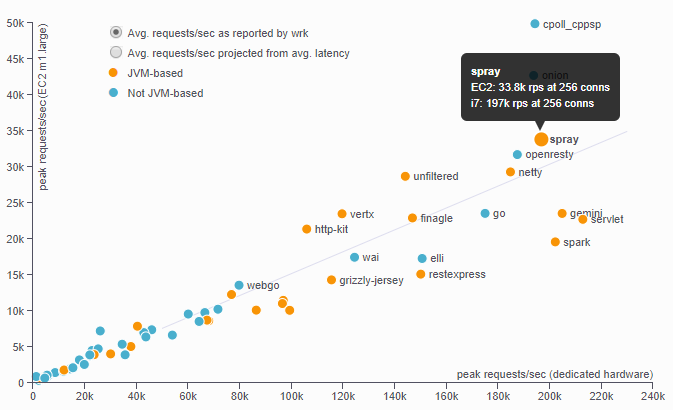
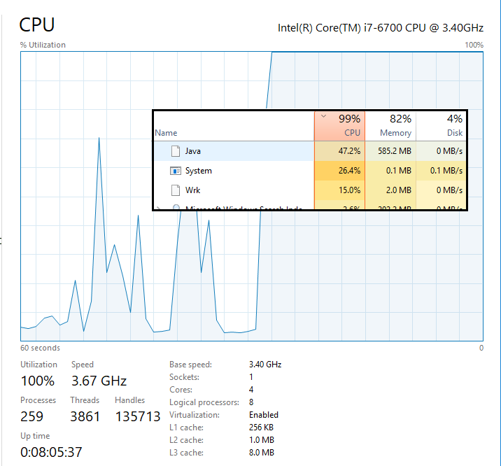

## Overview

TL;DR) Benchmarking Akka HTTP and Spray "Hello World" servers did not discover significant performance difference.

- On Macbook, with Intel CPU Core i5 2.6GHz 2 cores

| Attempt    |  Akka HTTP      | Spray          |
|:-----------|----------------:|:--------------:|
|1st attempt | 34,494 req/sec  | 37,005 req/sec |
|2nd attempt | 41,469 req/sec  | 41,586 req/sec |
|3rd attempt | 41,535 req/sec  | 42,438 req/sec |


- On Windows, with Intel CPU Core i7-6700 3.4GHz 4 cores/8 threads

| Attempt    |  Akka HTTP     | Spray         |
|:-----------|---------------:|:-------------:|
|1st attempt | 75,439 req/sec | 80,108 req/sec|
|2nd attempt | 80,106 req/sec | 80,453 req/sec|
|3rd attempt | 79,608 req/sec | 84,446 req/sec|

## Motivation

I am planning to write up articles analyzing Akka HTTP performance going forward, (probably about Akka internals too) so wanted to get familiar with tooling and procedure.

So this very first article is pretty "rough", but still this gives me an insight about Akka HTTP's performance relative to Spray. I was interested in this relative performance analysis because one of Akka HTTP's performance goals was to catch up with Spray's performance.

If you are conducting a serious performance analysis, you would not take benchmark in this way, as my "Hello World" server was too simple and I only used a single machine to run the server and the client, which hides whether the bottleneck was on the client or the server.

## References

### akka-user discussion 

There is a similiar discussion about Akka HTTP performance in the [akka-user mailing list](https://groups.google.com/forum/#!topic/akka-user/qhZlh0KBl2A), where the benchmark was taken using a tool called [wrk](https://github.com/wg/wrk) against a simple serve doing hell-world json marshalling.

> Whereas for the Akka HTTP version I saw each core using ~40% CPU throughout the test and I had the following results:
> ...
```
  2 threads and 100 connections
  Thread calibration: mean lat.: 5.044ms, rate sampling interval: 10ms
  Thread calibration: mean lat.: 5.308ms, rate sampling interval: 10ms
  Thread Stats   Avg      Stdev     Max   +/- Stdev
    Latency     1.83ms    1.27ms  78.91ms   95.96%
    Req/Sec    10.55k     1.79k   28.22k    75.98%
  5997552 requests in 5.00m, 1.00GB read
Requests/sec:  19991.72
Transfer/sec:      3.41MB
```

The number I foncus on this time, was **req/sec: 19991.72**. Of course we have to look at various characteristics of performance in more serious analsys, but this is just a starting point for now.

### Spray team blog



Also there is a [Spray team blog entry](http://spray.io/blog/2013-05-24-benchmarking-spray/) which shows its performance. As it says the benchmark server was doing JSON serialization without db access, it was probably similar to the above akka-user discussion.

The req/sec was 33.8K in Spray but 19.9K in Akka HTTP. So my question was, 
"**how do they perform on the same machine, doing the same thing?**"

Maybe the difference in their performance was due to the difference on the machines the benchmark was run, and probably because the code of one experiment was bit more complicated than the other.

## My Bencmarking setup

I set up a very, very simple HTTP server in both in Akka HTTP and Spray, where the Spray one was inspired by its [official template](https://github.com/spray/spray-template).

### Akka HTTP 

[full code here](https://github.com/richardimaoka/resources/tree/master/akka-http-minimal) 

```scala
import java.io.{PrintWriter, StringWriter}

import akka.actor.ActorSystem
import akka.http.scaladsl.Http
import akka.http.scaladsl.server.Directives._
import akka.http.scaladsl.server.Route
import akka.stream.ActorMaterializer

import scala.concurrent.Await
import scala.concurrent.duration.Duration

object HttpServer extends {
  def main(args: Array[String]): Unit = {
    implicit val system: ActorSystem = ActorSystem("HttpServer")
    implicit val materializer: ActorMaterializer = ActorMaterializer()

    lazy val routes: Route =
      pathEndOrSingleSlash {
        complete("Hello World")
      }

    Http().bindAndHandle(routes, "localhost", 8088)
    println(s"Server online at http://localhost:8088/")
    Await.result(system.whenTerminated, Duration.Inf)
  }
}
```

### Spray

[full code here](https://github.com/richardimaoka/resources/tree/master/spray-minimal)

```scala
import akka.actor.{Actor, ActorSystem, Props}
import akka.io.IO
import akka.pattern.ask
import akka.util.Timeout
import spray.can.Http
import spray.routing.HttpService

import scala.concurrent.duration._

// this trait defines our service behavior independently from the service actor
trait MyService extends HttpService {
  val myRoute =
    path("") {
      complete("Hello World")
    }
}

// we don't implement our route structure directly in the service actor because
// we want to be able to test it independently, without having to spin up an actor
class MyServiceActor extends Actor with MyService {

  // the HttpService trait defines only one abstract member, which
  // connects the services environment to the enclosing actor or test
  def actorRefFactory = context

  // this actor only runs our route, but you could add
  // other things here, like request stream processing
  // or timeout handling
  def receive = runRoute(myRoute)
}


object HttpServer {
  def main(args: Array[String]): Unit = {
    // we need an ActorSystem to host our application in
    implicit val system = ActorSystem("on-spray-can")

    // create and start our service actor
    val service = system.actorOf(Props[MyServiceActor], "demo-service")

    implicit val timeout = Timeout(5.seconds)
    // start a new HTTP server on port 8090 with our service actor as the handler
    IO(Http) ? Http.Bind(service, interface = "localhost", port = 8090)
  }
}
````

### Benchmarking method in detail

Same as the akka-user discussion, I used [wrk](https://github.com/wg/wrk) to test the servers. On my Macbook (with Intel CPU Core i5 2.6GHz 2 cores), and got the following results for req/sec. This is the same table as I pasted at the beginning of the article. 

The reason I tried 3 attempts each was that due to JVM's JIT (Just-in-time) compilation, the frist and probably second attemps might not be at at the possible best performance. 

| Attempt    |  Akka HTTP      | Spray          |
|:-----------|----------------:|:--------------:|
|1st attempt | 34,494 req/sec  | 37,005 req/sec |
|2nd attempt | 41,469 req/sec  | 41,586 req/sec |
|3rd attempt | 41,535 req/sec  | 42,438 req/sec |

Taking more detailed results from the 3rd attempts, for **Akka HTTP**:

```
> wrk -t2 -c100 -d30s http://127.0.0.1:8088
Running 30s test @ http://127.0.0.1:8088
  2 threads and 100 connections
  Thread Stats   Avg      Stdev     Max   +/- Stdev
    Latency     3.88ms   18.33ms 485.74ms   97.91%
    Req/Sec    21.02k     4.59k   35.18k    82.57%
  1248199 requests in 30.05s, 184.51MB read
Requests/sec:  41535.58
Transfer/sec:      6.14MB
```

and for **Spray**:

```
> wrk -t2 -c100 -d30s http://127.0.0.1:8090
Running 30s test @ http://127.0.0.1:8090
  2 threads and 100 connections
  Thread Stats   Avg      Stdev     Max   +/- Stdev
    Latency     3.98ms   11.38ms 163.62ms   94.70%
    Req/Sec    21.60k     5.89k   48.67k    77.40%
  1273545 requests in 30.01s, 185.83MB read
Requests/sec:  42438.22
Transfer/sec:      6.19MB
```

They look like performing in a similar level. 

Then I did the same thing on my Windows machine as well (with Intel CPU Core i7-6700 3.4GHz 4 cores/8 threads), and results were as follows:

| Attempt    |  Akka HTTP     | Spray         |
|:-----------|---------------:|:-------------:|
|1st attempt | 75,439 req/sec | 80,108 req/sec|
|2nd attempt | 80,106 req/sec | 80,453 req/sec|
|3rd attempt | 79,608 req/sec | 84,446 req/sec|

Detailed results from the 3rd attempt for **Akka HTTP**,

```
> wrk -t2 -c100 -d30s http://127.0.0.1:8095/
Running 30s test @ http://127.0.0.1:8095/
  2 threads and 100 connections
  Thread Stats   Avg      Stdev     Max   +/- Stdev
    Latency     1.46ms    6.53ms 260.11ms   98.93%
    Req/Sec     40.08k    6.85k   59.53k    64.67%
  2395691 requests in 30.09s, 354.13MB read
Requests/sec:  79608.66
Transfer/sec:     11.77MB
```

and for **Spray**, and these also gave similar perforamance.

```
> wrk -t2 -c100 -d30s http://127.0.0.1:8093/
Running 30s test @ http://127.0.0.1:8093/
  2 threads and 100 connections
  Thread Stats   Avg      Stdev     Max   +/- Stdev
    Latency     1.18ms    2.68ms  61.62ms   98.26%
    Req/Sec    42.55k     8.20k   61.00k    61.10%
  2542858 requests in 30.11s, 371.03MB read
Requests/sec:  84446.09
Transfer/sec:     12.32MB
```

Here's the CPU usage profile on Windows at one point running the benchmark. The "Java" one is the Akka HTTP server. 



In a realistic situation where you, typically need to read and write to and from databases, etc, your web server won't be using CPU up to 100%, but network/database I/O tend to be bottlenecks. 

For now the experiment in this article tells us how the server behaves in the best possible situation where the CPU becomes the bottleneck.

## Lessons learned and plans going forward ...

Just don't rely on these results and assume like "Akka HTTP and Spray can perform at this level!".

As you saw here, benchmark results could significantly vary based on machines you run the bench. We have to keep in mind that the benchmark results are specific to the setup, including machines you run the bench, the server implementation and what kind of work the server does, latency and throughput between components if there are multiple components involved, etc.

Also, what "realistic" benchmark actually means depends on what your target application (web server) is. We have to pay attention that the difference between application's production environment and the benchmark environment.

Although having realistic setup, close to your production environment is important, another thing to note is that there is no one-size-fits-all benchmark method. Like anything else in software engineering, you should have differnt tooling for different aspects of benchmarking. You might think that if you make the benchmark environment as close as your production environment, you will get the most accurate results and that's it. However, that way, you cannot identify which component is the bottleneck of the performance when you see your entire application's performance is not satisfactory. You need more granular results from different parts of the system.

That is why I did this very simple, ridiculously simple benchmarking. This didn't give us any realistic performance figure which we can guess the production performance from, but it gave me a sense on maximum possible performance of Akka HTTP web server. (Actually, better experiment is to run the client and the server on different machines though.)

By testing each component individually, also testing in small groups of components, you will then realize the performance cap of each part of your entire application. Comparing that with your benchmark agains the whole application system, you will be able to figure out what is the bottleneck, and what part of the application is not scaling as you would have expected.

So I am going to write up other articles to cover these aspects to show procedure on performing (web) application performance testing, and hopefully micro benchmarking internals of akka application/service too.

