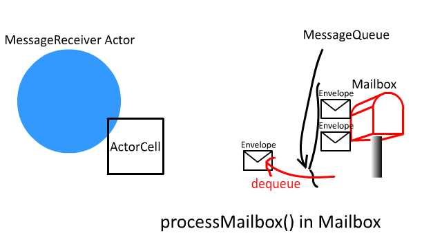
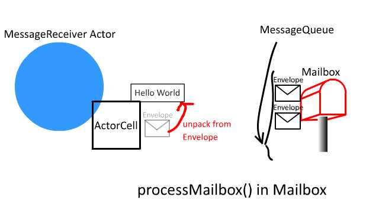

## Overview

You can find the code and instruction to run the example at [GitHub](https://github.com/richardimaoka/resources/tree/master/local-minimal).

<iframe width="640" height="360" src="https://www.youtube.com/embed/LbuLAtN20HA" frameborder="0" allow="autoplay; encrypted-media" allowfullscreen></iframe>


## Workflow 

```scala
//ForkJoinWorkerThread.java in akka.dispatch.forkjoin
  public void run() {...} 
```

```scala
//abstract class Mailbox
  @tailrec private final def processMailbox(
    ...
    val next = dequeue() //  def dequeue(): Envelope = messageQueue.dequeue()
    ...
    actor invoke next
    ...
    processMailbox(...)
  }
```




```scala
//class ActorCell
  final def invoke(messageHandle: Envelope): Unit
```

```scala
//class ActorCell
  def actor: Actor = _actor // return type is `Actor`
  ...
  final def receiveMessage(msg: Any): Unit = actor.aroundReceive(behaviorStack.head, msg)
```



```scala
//class ActorCell
  @InternalApi
  protected[akka] def aroundReceive(receive: Actor.Receive, msg: Any): Unit = {
    // optimization: avoid allocation of lambda
    if (receive.applyOrElse(msg, Actor.notHandledFun).asInstanceOf[AnyRef] eq Actor.NotHandled) {
      unhandled(msg)
    }
  }
```

```scala
class MessageReceiver extends Actor {
  def receive = {
    case s: String =>
      EchoActor: received message = $s")
  }
}
```


## Instruction to run the example
```
> git clone https://github.com/richardimaoka/resources.git
> cd resources
> cd serialize-minimal
> sbt
> runMain example.Main
```

## Output 

Some `println` calls are inserted in the [complete example at GitHub](https://github.com/richardimaoka/resources/tree/master/local-minimal) to illustrate the behavior.

Thread names are shown as [exampleSystem-akka.actor.default-dispatcher-3] and [...-4].


```
[info] Running example.Main
provider = local
[exampleSystem-akka.actor.default-dispatcher-3] sending message Hello World to Actor[akka://exampleSystem/user/receiver#607760908]
[exampleSystem-akka.actor.default-dispatcher-3] sending message Hello Universe to Actor[akka://exampleSystem/user/receiver#607760908]
[exampleSystem-akka.actor.default-dispatcher-4] EchoActor: received message = Hello World
[exampleSystem-akka.actor.default-dispatcher-3] sending message Hello Galaxy to Actor[akka://exampleSystem/user/receiver#607760908]
[exampleSystem-akka.actor.default-dispatcher-4] EchoActor: received message = Hello Universe
[exampleSystem-akka.actor.default-dispatcher-4] EchoActor: received message = Hello Galaxy
[success] Total time: 9 s, completed Jan 29, 2018 6:44:14 AM
```

## References 

- Official documentation of Akka serialization at https://doc.akka.io/docs/akka/2.5/serialization.html
