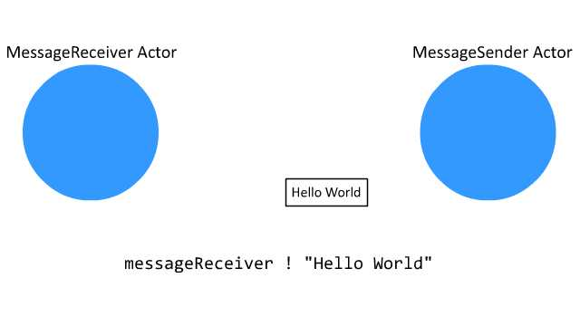
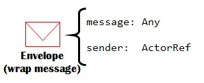
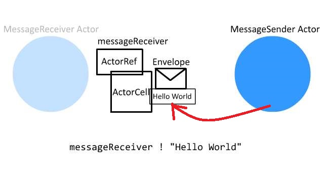
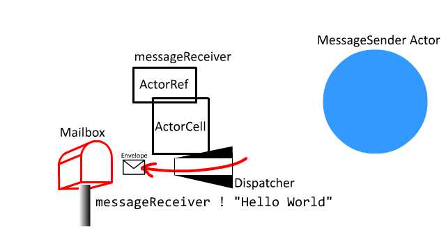
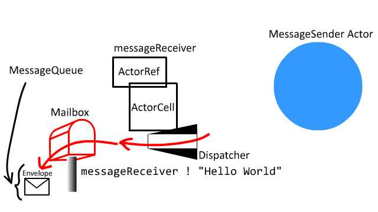

## Overview

You can find the code and instruction to run the example at [GitHub](https://github.com/richardimaoka/resources/tree/master/local-minimal).

<iframe width="640" height="360" src="https://www.youtube.com/embed/SKOpmttB47A" frameborder="0" allow="autoplay; encrypted-media" allowfullscreen></iframe>

This is about how Akka sends a message from one Actor to another **locally** (i.e. within the same JVM). As in the [`Serialization` part](https://doc.akka.io/docs/akka/2.5/serialization.html?language=scala) of the official doc:

> The messages that Akka actors send to each other are JVM objects (e.g. instances of Scala case classes). Message passing between actors that live on the same JVM is straightforward. It is simply done via reference passing. 

Refer to the remote sender article, which I will write up soon, when sending a message to a remote actor on a different JVM.

## Workflow 

[`MessageSender`](https://github.com/richardimaoka/resources/blob/master/local-minimal/src/main/scala/example/Main.scala#L14L24) sends messages "Hello World", "Hello Universe" and "Hello Galaxy" to the `messageReceiver` actor.

```scala
class MessageSender(messageReceiver: ActorRef) extends Actor {
  override def preStart(): Unit = {
    val messages = List(
      "Hello World",
      "Hello Universe",
      "Hello Galaxy"
    )

    for(msg <- messages) {
      messageReceiver ! msg
    }
  }
  ....
}
```

The `preStart` method is a [lifecycle method](https://doc.akka.io/docs/akka/2.5/guide/tutorial_1.html?language=scala#the-actor-lifecycle) provided by Akka Actor.

The below is what's inside the main method, which initializes the receiver and the sender.

```scala
val system = ActorSystem("exampleSystem")

val receiver = system.actorOf(Props[MessageReceiver], "receiver")
system.actorOf(MessageSender.props(receiver), "sender")
```

As in the `preStart` method of `MessageSender`, the first message to be sent is,

```scala
messageReceiver ! "Hello World",
```



where the [`!` method](https://github.com/akka/akka/blob/v2.5.9/akka-actor/src/main/scala/akka/actor/ActorRef.scala#L400) is a method of `LocalActorRef`.

```scala
override def !(message: Any)
  (implicit sender: ActorRef = Actor.noSender): Unit =
    actorCell.sendMessage(message, sender)
```

Above `actorCell` is an instance of [`ActorCell`](https://github.com/akka/akka/blob/v2.5.9/akka-actor/src/main/scala/akka/actor/ActorCell.scala#L370), which implements [`Cell` trait](https://github.com/akka/akka/blob/v2.5.9/akka-actor/src/main/scala/akka/actor/ActorCell.scala#L220), and the `Cell` trait has the following [`sendMessage`](https://github.com/akka/akka/blob/v2.5.9/akka-actor/src/main/scala/akka/actor/ActorCell.scala#L290L291).

```scala
final def sendMessage(
  message: Any, 
  sender: ActorRef
): Unit =
  sendMessage(Envelope(message, sender, system))
```

Here you see an [`Envelope`](https://github.com/akka/akka/blob/v2.5.9/akka-actor/src/main/scala/akka/dispatch/AbstractDispatcher.scala#L23) which encapsulates `message` and `sender`



```scala
case class Envelope(val message: Any, val sender: ActorRef)
```

To illustrate the workflow so far up to the `sendMessage`:



The `sendMessage` method of the `Cell` trait (`ActorCell`) calls the [`sendMessage` method](https://github.com/akka/akka/blob/v2.5.9/akka-actor/src/main/scala/akka/actor/dungeon/Dispatch.scala#L136) of the `Dispatch` trait.

```scala
def sendMessage(msg: Envelope): Unit =
  try {
    ...
    dispatcher.dispatch(this, msg)
  } 
```

([The concept of `Dispatcher`](https://doc.akka.io/docs/akka/2.5/dispatchers.html?language=scala) might be unfamiliar to you and it is probably difficult to understand. I will write another article later to illustrate `Dispatcher` in more detail, but for now, you can assume dispatcher is, as the meaning of the word says, "sender" of messages.)

There are two distinct `Dispatch` and `Dispatcher` traits in akka. The `Dispatch` trait has a reference to `dispatch: Dispatcher` and `Dispatcher`'s [dispatch](https://github.com/akka/akka/blob/v2.5.9/akka-actor/src/main/scala/akka/dispatch/Dispatcher.scala#L52L56) method is as follows:


```scala
def dispatch(
  receiver: ActorCell,
  invocation: Envelope
): Unit = {
  val mbox = receiver.mailbox
  mbox.enqueue(receiver.self, invocation)
  registerForExecution(mbox, true, false)
}
```



[`Mailbox`](https://github.com/akka/akka/blob/v2.5.9/akka-actor/src/main/scala/akka/dispatch/Mailbox.scala#L85) has the following `enqueue` method

```scala
def enqueue(receiver: ActorRef, msg: Envelope): Unit = messageQueue.enqueue(receiver, msg)
```



The `messageQueue` is type of [`MessageQueue`](https://github.com/akka/akka/blob/v2.5.9/akka-actor/src/main/scala/akka/dispatch/Mailbox.scala#L614L618) class which is defined for [each different `Mailbox` type](https://doc.akka.io/docs/akka/2.5/mailboxes.html?language=scala#mailboxes). The one for the default `UnboundedMailbox` is:

```scala
object UnboundedMailbox {
  class MessageQueue extends ConcurrentLinkedQueue[Envelope] with UnboundedQueueBasedMessageQueue {
    final def queue: Queue[Envelope] = this
  }
}
```

Coming back to the `dispatch` method of `Dispatcher`, it has [registerForExecution](https://github.com/akka/akka/blob/v2.5.9/akka-actor/src/main/scala/akka/dispatch/Dispatcher.scala#L115) as follows:

```scala
def registerForExecution(mbox: Mailbox, ...): Boolean = {
  ...
  executorService execute mbox
  ...
}
```

Since [`Mailbox`](https://github.com/akka/akka/blob/v2.5.9/akka-actor/src/main/scala/akka/dispatch/Mailbox.scala#L56L57) is defined as `ForkJoinTask`, the execution (i.e. processing) of `Mailbox` is run on a different `Thread`, which will be covered in [the next article](../local-minimal-receiver)

```scala
abstract class Mailbox(val messageQueue: MessageQueue)
  extends ForkJoinTask[Unit] 
  with SystemMessageQueue 
  with Runnable {
    ...
}
```

## Instruction to run the example
```
> git clone https://github.com/richardimaoka/resources.git
> cd resources
> cd local-minimal
> sbt
> runMain example.Main
```

## Output 

Some `println` calls are inserted in the [complete example at GitHub](https://github.com/richardimaoka/resources/tree/master/local-minimal) to illustrate the behavior.

Thread names are shown as [exampleSystem-akka.actor.default-dispatcher-3] and [...-4].

```
[info] Running example.Main
provider = local
[exampleSystem-akka.actor.default-dispatcher-5] sending message Hello World to Actor[akka://exampleSystem/user/receiver#-846959521]
[exampleSystem-akka.actor.default-dispatcher-5] sending message Hello Universe to Actor[akka://exampleSystem/user/receiver#-846959521]
[exampleSystem-akka.actor.default-dispatcher-2] EchoActor: received message = Hello World
[exampleSystem-akka.actor.default-dispatcher-5] sending message Hello Galaxy to Actor[akka://exampleSystem/user/receiver#-846959521]
[exampleSystem-akka.actor.default-dispatcher-2] EchoActor: received message = Hello Universe
[exampleSystem-akka.actor.default-dispatcher-2] EchoActor: received message = Hello Galaxy
[success] Total time: 7 s, completed Jan 30, 2018 6:16:46 AM
```

## References 

- Official documentation of Akka Actor at https://doc.akka.io/docs/akka/2.5/actors.html
- Official documentation of Akka Dispatcher at https://doc.akka.io/docs/akka/2.5/dispatchers.html
- Official documentation of Akka lifecycle at https://doc.akka.io/docs/akka/current/actors.html$actor-lifecycle
- Official documentation of Akka Mailbox at https://doc.akka.io/docs/akka/2.5/mailboxes.html?language=scala#mailboxes)
- Official documentation of Akka location transparency at https://doc.akka.io/docs/akka/current/general/remoting.html#location-transparency