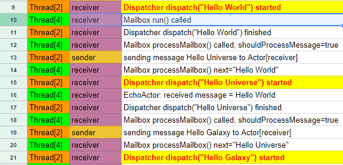

## Overview

<iframe width="640" height="360" src="https://www.youtube.com/embed/OQhqCIQgWLc" frameborder="0" allow="autoplay; encrypted-media" allowfullscreen></iframe>

The previous [Dispatcher behavior](../dispatcher-behavior/) article explained how `Dispatcher` and threads are related to each other. In this article, we will go one step further in this regard.

Akka's (internal) `Mailbox` extends [`ForkJoinTask`](https://docs.oracle.com/javase/8/docs/api/java/util/concurrent/ForkJoinTask.html), and it recursively calls its `processMailbox` method. This way, single `ForkJoinTask` can effectively process multiple messages without a pause, without unnecessarily waiting for the next `ForkJoinTask` is scheduled on a thread.

The code example is at [GitHub](https://github.com/richardimaoka/resources/tree/master/local-minimal). This is the same example as 
what's discussed in [the local actor article(s)](http://localhost:8000/local-minimal-sender/).

## Thread-processing details in Akka

Following the instruction at the bottom of this article, you will get output as follows [(also in GoogleSpreadsheet)](https://drive.google.com/open?id=194-t1rYNQU2mprybSC9RibJ7HopCAdPqJX94XlIKxXk) . 

**SO MANY things in the table!!, but no worries!**

We will go through each important piece, one after another.


## Caveats

You might notice that I am skipping some parts (some rows in the above table) in the article, but that is just to avoid confusion. Even with this simple example, Akka's internal processing is very complicated. So I am only covering pieces to help you understand important stuff.

## Thread[2] - sender side

<iframe width="640" height="360" src="https://www.youtube.com/embed/1w2ovhgsUJk" frameborder="0" allow="autoplay; encrypted-media" allowfullscreen></iframe>

Firstly, let's look at "Thread[2]" from the output table, which is pretty much the sender side. The sender `Actor`'s `Mailbox` was `run()`, 


which triggered [`MessageSender`](https://github.com/richardimaoka/resources/blob/master/local-minimal/src/main/scala/example/Main.scala#L15L20)'s `preStart()` method:

```scala
class MessageSender(messageReceiver: ActorRef) ... {
  override def preStart(): Unit = {
    val messages = List(
      "Hello World",
      "Hello Universe",
      "Hello Galaxy"
    )
    for(msg <- messages) {
      println(s"[${Thread.currentThread().getName}] sending message $msg to $messageReceiver")
      messageReceiver ! msg
    }
  }
  ...
}
```

The very first message, `"Hello World"` was `dispatch`-ed (sent) as follows:


and as in the [previous article](../dispatcher-behavior) the [`dispatch`](https://github.com/akka/akka/blob/v2.5.9/akka-actor/src/main/scala/akka/dispatch/Dispatcher.scala#L52L56) method is implemented as below, which puts the message to the message queue of the mailbox,

```scala
def dispatch(
  receiver: ActorCell,
  invocation: Envelope
): Unit = {
  val mbox = receiver.mailbox
  mbox.enqueue(receiver.self, invocation)
  registerForExecution(mbox, true, false)
}
```

then `registerForExecution` schedules a `ForkJoinTask` to be run on a different thread, as `mbox` is an instance of `Mailbox`, and [`Mailbox`](https://github.com/akka/akka/blob/v2.5.9/akka-actor/src/main/scala/akka/dispatch/Mailbox.scala#L56L57) exntends [`ForkJoinTask`] (https://docs.oracle.com/javase/8/docs/api/java/util/concurrent/ForkJoinTask.html) 

```scala
abstract class Mailbox(val messageQueue: MessageQueue)
  extends ForkJoinTask[Unit] 
  with SystemMessageQueue 
  with Runnable {
    ...
}
```

Same as the first message, the second ard thrid messages `"Hellow Universe"` and `"Hello Galaxy"` were `dispatch`-ed as well, and respective `ForkJoinTask` instances were scheduled.


## Thread[4] - receiver side

<iframe width="640" height="360" src="https://www.youtube.com/embed/cMvUlC0Xjn4" frameborder="0" allow="autoplay; encrypted-media" allowfullscreen></iframe>

Let's move onto the "Thread[4]", the receiver side behavior. The point here (and for the whole article) is that `processMailbox()` is a **recursive method**.

The scheduled `ForkJoinTask` triggered the `run` method. Remenber `Mailbox extends ForkJoinTask`, so `Mailbox` overrides the `run` method.


It's also discussed in the [previous article](../dispatcher-behavior), but `processMailbox` method executs the [`receive` method]((https://github.com/richardimaoka/resources/blob/master/local-minimal/src/main/scala/example/Main.scala#L8L11)
) of the `Actor`


```scala
class MessageReceiver extends Actor {
  def receive = {
    case s: String =>
      println(s"${Thread.currentThread()} [${self.path}] EchoActor: received message = $s")
  }
}
```

Next, you see `processMailbox()` was called multiple times before you see `Mailbox run() finished`.


This was because [`processMailbox` method](https://github.com/akka/akka/blob/v2.5.9/akka-actor/src/main/scala/akka/dispatch/Mailbox.scala#L250) called inside `run` was actually a `@tailorec`, (i.e. recursive) method, 

```scala
@tailrec private final def processMailbox(
  ...
  // def dequeue(): Envelope = messageQueue.dequeue()
  val next = dequeue() 
  ...
  actor invoke next
  ...
  processMailbox(...)
}
```

so it processed all the three messages `"Hello World"`, `"Hello Universe"` and `"Hello Galaxy"` in the same `ForkJoinTask` `run`. You see four "processMailbox() finished" consecutively afterwards.


If you remember the sender side, it scheduled three `ForkJoinTask`. What happened to the other two `ForkJoinTask`? The second and thrid `ForkJoinTask` did nothing, as there was no message to process.

<iframe width="640" height="360" src="https://www.youtube.com/embed/0ifndskdsmQ" frameborder="0" allow="autoplay; encrypted-media" allowfullscreen></iframe>

Now you see the point, **single `ForkJoinTask` can process multiple messages**, without switching to the next `ForkJoinTask`. Akka can be efficient by avoiding such unnecessary task-switching on threads. 

How many messages can be processed by a single `ForkJoinTask` is controlled by the `throughput` setting in [config](https://github.com/akka/akka/blob/v2.5.9/akka-actor/src/main/resources/reference.conf#L513).

```
# Throughput defines the number of messages that are processed in a batch
# before the thread is returned to the pool. Set to 1 for as fair as possible.
throughput = 5
```

## Bonus stuff - both in action

Let's put both the sender and the receiver in the same time frame, and it looks like chaos. Yeah indeed the point of using actors is to program such chaotic behavior in more fine grained actors so you can think about what each actor `receive`s, and how to react on it.

<iframe width="640" height="360" src="https://www.youtube.com/embed/qdiOC8PTPhc" frameborder="0" allow="autoplay; encrypted-media" allowfullscreen></iframe>



## Instruction to run the example, and output

We can use [the same example code](https://github.com/richardimaoka/resources/tree/master/local-minimal) as the "[Local Actor workflow part 1 - Sender side](../local-minimal-sender)" article.code.

However, because you need a bit of tweaking in the akka code, clone the akka repository,

```
> git clone https://github.com/akka/akka.git
> cd akka
```

and insert `println` calls ([link to the code change](https://github.com/richardimaoka/akka/commit/6b19cabf3d9895fd8cc925b760f6b9ec21a1eaef)) in akka to see the `Mailbox` and `Dispatcher` behavior. Then execute `publishLocal`.

```
> sbt
> project akka-actor
> publishLocal
```

Now you will see `akka-actor_2.12;2.5-SNAPSHOT` is built and stored under your `.ivy` directory.

```
[info] :: delivering :: com.typesafe.akka#akka-actor_2.12;2.5-SNAPSHOT :: 2.5-SNAPSHOT :: integration :: Thu Feb 22 07:22:33 JST 2018
[info]  delivering ivy file to Users/username/akka/akka-actor/target/ivy-2.5-SNAPSHOT.xml
[info]  published akka-actor_2.12 to Users/username/.ivy2/local/com.typesafe.akka/akka-actor_2.12/2.5-SNAPSHOT/poms/akka-actor_2.12.pom
[info]  published akka-actor_2.12 to Users/username/.ivy2/local/com.typesafe.akka/akka-actor_2.12/2.5-SNAPSHOT/jars/akka-actor_2.12.jar
[info]  published akka-actor_2.12 to Users/username/.ivy2/local/com.typesafe.akka/akka-actor_2.12/2.5-SNAPSHOT/srcs/akka-actor_2.12-sources.jar
[info]  published akka-actor_2.12 to Users/username/.ivy2/local/com.typesafe.akka/akka-actor_2.12/2.5-SNAPSHOT/docs/akka-actor_2.12-javadoc.jar
[info]  published ivy to Users/username/.ivy2/local/com.typesafe.akka/akka-actor_2.12/2.5-SNAPSHOT/ivys/ivy.xml
```

From here you move to the [local actor example code](https://github.com/richardimaoka/resources/tree/master/local-minimal). 


```
> cd ~
// or `cd` to whatever directory you like

> git clone https://github.com/richardimaoka/resources.git
> cd resources
> cd local-minimal
```

Make [this change](https://github.com/richardimaoka/resources/commit/15e140cb110e8ca37934eb150da94fea49e3431cl) to the local example code, to use the 2.5-SNAPSHOT version of `akka-actor` jar built by the above step.

```
//build.sbt
 libraryDependencies ++= Seq(
-  "com.typesafe.akka" %% "akka-actor" % "2.5.9",
+  "com.typesafe.akka" %% "akka-actor" % "2.5-SNAPSHOT",
   scalaTest % Test
 )
```

From inside the `local-minimal` directory, you can do:

```
> sbt
> runMain example.Main
```

and you will output like the following (order of messages could be little differnt due to concurrency). 

After I did some clean-up, I posted the result [here in Google Spreadsheet](https://drive.google.com/open?id=194-t1rYNQU2mprybSC9RibJ7HopCAdPqJX94XlIKxXk). (Shortened the thread name, exclude [user guardian](https://doc.akka.io/docs/akka/2.5/general/supervision.html#user-the-guardian-actor) from logs, shortened the actor path, etc)

```
Thread[exampleSystem-akka.actor.default-dispatcher-2,5,run-main-group-8] [akka://exampleSystem/user/sender] Mailbox run() called
Thread[exampleSystem-akka.actor.default-dispatcher-4,5,run-main-group-8] [akka://exampleSystem/user] Mailbox processMailbox() next=null
Thread[exampleSystem-akka.actor.default-dispatcher-3,5,run-main-group-8] [akka://exampleSystem/user/receiver] Mailbox processMailbox() finished
Thread[exampleSystem-akka.actor.default-dispatcher-4,5,run-main-group-8] [akka://exampleSystem/user] Mailbox processMailbox() finished
Thread[exampleSystem-akka.actor.default-dispatcher-3,5,run-main-group-8] [akka://exampleSystem/user/receiver] Mailbox run() finished
Thread[exampleSystem-akka.actor.default-dispatcher-2,5,run-main-group-8] [akka://exampleSystem/user/sender] sending message Hello World to Actor[akka://exampleSystem/user/receiver#1486562265]
Thread[exampleSystem-akka.actor.default-dispatcher-4,5,run-main-group-8] [akka://exampleSystem/user] Mailbox run() finished
Thread[exampleSystem-akka.actor.default-dispatcher-2,5,run-main-group-8] [akka://exampleSystem/user/receiver] Dispatcher dispatch(Envelope(Hello World,Actor[akka://exampleSystem/user/sender#-1400752577])) started
Thread[exampleSystem-akka.actor.default-dispatcher-4,5,run-main-group-8] [akka://exampleSystem/user/receiver] Mailbox run() called
Thread[exampleSystem-akka.actor.default-dispatcher-2,5,run-main-group-8] [akka://exampleSystem/user/receiver] Dispatcher dispatch(Envelope(Hello World,Actor[akka://exampleSystem/user/sender#-1400752577])) finished
Thread[exampleSystem-akka.actor.default-dispatcher-4,5,run-main-group-8] [akka://exampleSystem/user/receiver] Mailbox processMailbox() called, shouldProcessMessage=true
Thread[exampleSystem-akka.actor.default-dispatcher-2,5,run-main-group-8] [akka://exampleSystem/user/sender] sending message Hello Universe to Actor[akka://exampleSystem/user/receiver#1486562265]
Thread[exampleSystem-akka.actor.default-dispatcher-4,5,run-main-group-8] [akka://exampleSystem/user/receiver] Mailbox processMailbox() next=Envelope(Hello World,Actor[akka://exampleSystem/user/sender#-1400752577])
Thread[exampleSystem-akka.actor.default-dispatcher-2,5,run-main-group-8] [akka://exampleSystem/user/receiver] Dispatcher dispatch(Envelope(Hello Universe,Actor[akka://exampleSystem/user/sender#-1400752577])) started
Thread[exampleSystem-akka.actor.default-dispatcher-4,5,run-main-group-8] [akka://exampleSystem/user/receiver] EchoActor: received message = Hello World
Thread[exampleSystem-akka.actor.default-dispatcher-2,5,run-main-group-8] [akka://exampleSystem/user/receiver] Dispatcher dispatch(Envelope(Hello Universe,Actor[akka://exampleSystem/user/sender#-1400752577])) finished
Thread[exampleSystem-akka.actor.default-dispatcher-4,5,run-main-group-8] [akka://exampleSystem/user/receiver] Mailbox processMailbox() called, shouldProcessMessage=true
Thread[exampleSystem-akka.actor.default-dispatcher-2,5,run-main-group-8] [akka://exampleSystem/user/sender] sending message Hello Galaxy to Actor[akka://exampleSystem/user/receiver#1486562265]
Thread[exampleSystem-akka.actor.default-dispatcher-4,5,run-main-group-8] [akka://exampleSystem/user/receiver] Mailbox processMailbox() next=Envelope(Hello Universe,Actor[akka://exampleSystem/user/sender#-1400752577])
Thread[exampleSystem-akka.actor.default-dispatcher-2,5,run-main-group-8] [akka://exampleSystem/user/receiver] Dispatcher dispatch(Envelope(Hello Galaxy,Actor[akka://exampleSystem/user/sender#-1400752577])) started
Thread[exampleSystem-akka.actor.default-dispatcher-4,5,run-main-group-8] [akka://exampleSystem/user/receiver] EchoActor: received message = Hello Universe
Thread[exampleSystem-akka.actor.default-dispatcher-2,5,run-main-group-8] [akka://exampleSystem/user/receiver] Dispatcher dispatch(Envelope(Hello Galaxy,Actor[akka://exampleSystem/user/sender#-1400752577])) finished
Thread[exampleSystem-akka.actor.default-dispatcher-4,5,run-main-group-8] [akka://exampleSystem/user/receiver] Mailbox processMailbox() called, shouldProcessMessage=true
Thread[exampleSystem-akka.actor.default-dispatcher-2,5,run-main-group-8] [akka://exampleSystem/user/sender] Mailbox processMailbox() called, shouldProcessMessage=true
Thread[exampleSystem-akka.actor.default-dispatcher-4,5,run-main-group-8] [akka://exampleSystem/user/receiver] Mailbox processMailbox() next=Envelope(Hello Galaxy,Actor[akka://exampleSystem/user/sender#-1400752577])
Thread[exampleSystem-akka.actor.default-dispatcher-2,5,run-main-group-8] [akka://exampleSystem/user/sender] Mailbox processMailbox() next=null
Thread[exampleSystem-akka.actor.default-dispatcher-4,5,run-main-group-8] [akka://exampleSystem/user/receiver] EchoActor: received message = Hello Galaxy
Thread[exampleSystem-akka.actor.default-dispatcher-2,5,run-main-group-8] [akka://exampleSystem/user/sender] Mailbox processMailbox() finished
Thread[exampleSystem-akka.actor.default-dispatcher-4,5,run-main-group-8] [akka://exampleSystem/user/receiver] Mailbox processMailbox() called, shouldProcessMessage=true
Thread[exampleSystem-akka.actor.default-dispatcher-2,5,run-main-group-8] [akka://exampleSystem/user/sender] Mailbox run() finished
Thread[exampleSystem-akka.actor.default-dispatcher-4,5,run-main-group-8] [akka://exampleSystem/user/receiver] Mailbox processMailbox() next=null
Thread[exampleSystem-akka.actor.default-dispatcher-4,5,run-main-group-8] [akka://exampleSystem/user/receiver] Mailbox processMailbox() finished
Thread[exampleSystem-akka.actor.default-dispatcher-4,5,run-main-group-8] [akka://exampleSystem/user/receiver] Mailbox processMailbox() finished
Thread[exampleSystem-akka.actor.default-dispatcher-4,5,run-main-group-8] [akka://exampleSystem/user/receiver] Mailbox processMailbox() finished
Thread[exampleSystem-akka.actor.default-dispatcher-4,5,run-main-group-8] [akka://exampleSystem/user/receiver] Mailbox processMailbox() finished
Thread[exampleSystem-akka.actor.default-dispatcher-4,5,run-main-group-8] [akka://exampleSystem/user/receiver] Mailbox run() finished
Thread[exampleSystem-akka.actor.default-dispatcher-4,5,run-main-group-8] [akka://exampleSystem/user] Mailbox run() called
Thread[exampleSystem-akka.actor.default-dispatcher-2,5,run-main-group-8] [akka://exampleSystem/user/receiver] Mailbox run() called
Thread[exampleSystem-akka.actor.default-dispatcher-3,5,run-main-group-8] [akka://exampleSystem/user/sender] Mailbox run() called
Thread[exampleSystem-akka.actor.default-dispatcher-4,5,run-main-group-8] [akka://exampleSystem/user] Mailbox processMailbox() called, shouldProcessMessage=false
Thread[exampleSystem-akka.actor.default-dispatcher-3,5,run-main-group-8] [akka://exampleSystem/user/sender] Mailbox processMailbox() called, shouldProcessMessage=false
Thread[exampleSystem-akka.actor.default-dispatcher-3,5,run-main-group-8] [akka://exampleSystem/user/sender] Mailbox processMailbox() finished
Thread[exampleSystem-akka.actor.default-dispatcher-3,5,run-main-group-8] [akka://exampleSystem/user/sender] Mailbox run() finished
Thread[exampleSystem-akka.actor.default-dispatcher-2,5,run-main-group-8] [akka://exampleSystem/user/receiver] Mailbox processMailbox() called, shouldProcessMessage=false
Thread[exampleSystem-akka.actor.default-dispatcher-4,5,run-main-group-8] [akka://exampleSystem/user] Mailbox processMailbox() finished
Thread[exampleSystem-akka.actor.default-dispatcher-2,5,run-main-group-8] [akka://exampleSystem/user/receiver] Mailbox processMailbox() finished
Thread[exampleSystem-akka.actor.default-dispatcher-3,5,run-main-group-8] [akka://exampleSystem/user] Mailbox run() called
Thread[exampleSystem-akka.actor.default-dispatcher-4,5,run-main-group-8] [akka://exampleSystem/user] Mailbox run() finished
Thread[exampleSystem-akka.actor.default-dispatcher-2,5,run-main-group-8] [akka://exampleSystem/user/receiver] Mailbox run() finished
Thread[exampleSystem-akka.actor.default-dispatcher-3,5,run-main-group-8] [akka://exampleSystem/user] Mailbox run() finished
Thread[exampleSystem-akka.actor.default-dispatcher-3,5,run-main-group-8] [akka://exampleSystem/user] Mailbox processMailbox() called, shouldProcessMessage=false
Thread[exampleSystem-akka.actor.default-dispatcher-3,5,run-main-group-8] [akka://exampleSystem/user] Mailbox processMailbox() finished
```