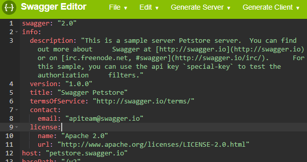
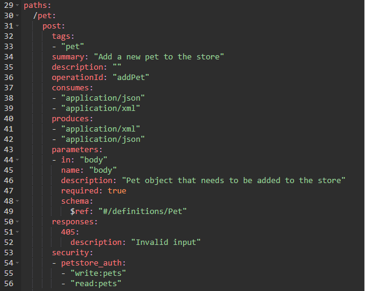
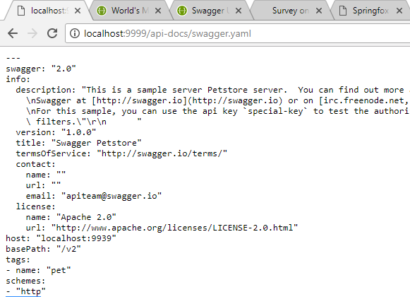
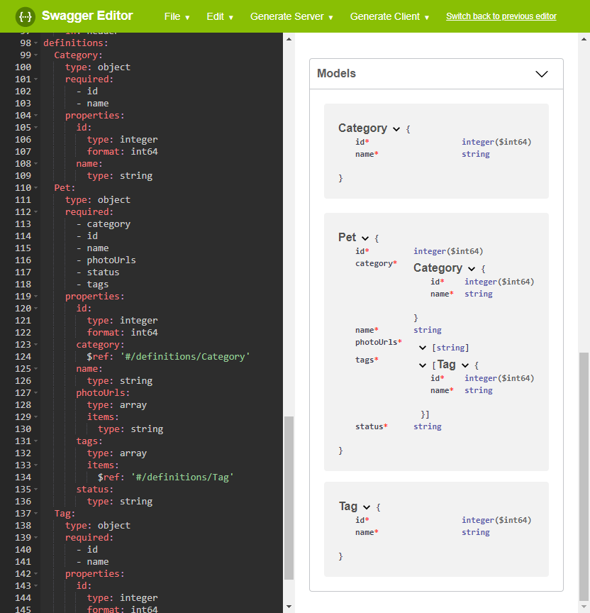
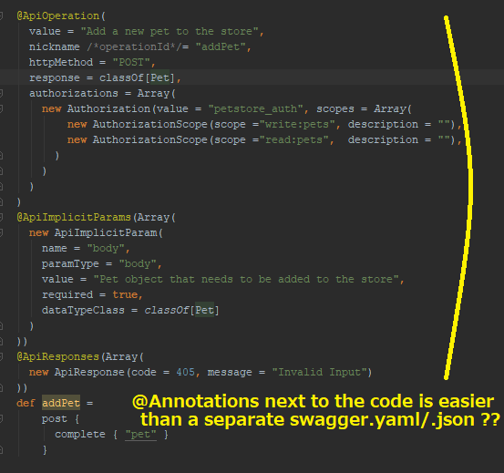
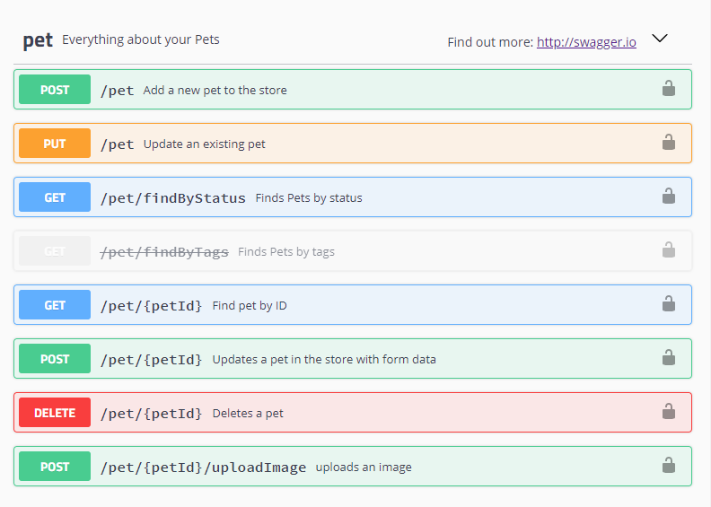
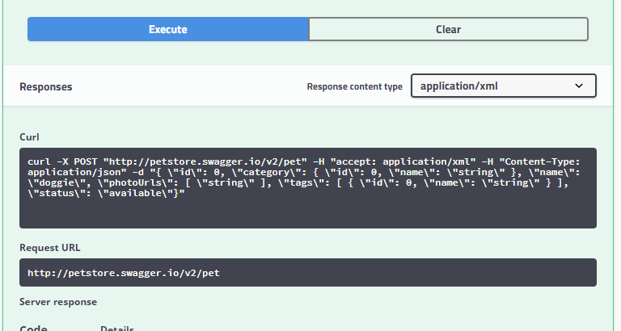

## Overview

**TL;DR)** You can use Swagger with Akka HTTP and get some benefit from Swagger, but the workflow is not fully automated with existing tools.

Recently I did some personal survey on how Swagger can be integrated with Akka HTTP. Before the survey, I was expeciting automation just works like:

1) Swagger spec file can generate Akka HTTP server code

2) or `@Annotations` in the server code generate the Swagger specification

but there are limitations to both 1) and 2), which I will explain later in the article.

## Top-down and bottom-up approaches

Let me firstly introduce so-called top-down and bottom-up approaches in terms of how to use Swagger, which is also explained in the official [getting started guide](https://swagger.io/getting-started/).

> A top-down approach where you would use the Swagger Editor to create your Swagger definition and then use the integrated Swagger Codegen tools to generate server implementation.

> A bottom-up approach where you have an existing REST API for which you want to create a Swagger definition

[Swagger Editor](https://editor.swagger.io/) is a browser based tool for editing the swagger specification file in json or yaml. For [Swagger codegen](https://github.com/swagger-api/swagger-codegen), it already officially supports a bunch of languages and frameworks,


 and also a lot of community plugins available for other frameworks.

### When to use which approach? 

The top-down approach is suitable when:

- you have an automatic tool to generate the server-side code
- or you are developing a brand new API-based service, and the client wants to start development without waiting for the server side implementation ready

To automatically generate the server side implementation, it usually doesn't produce fully detailed implementation, but it generates interfaces (in Scala, it would be traits) which you can extend to hook up detailed behaivor in a later phase.

On the other hand, the bottom-up approach would be suitable when:

- a Swagger spec-gen tool is avaialble from the server side code
- or you already have the server side implementation, and want to start using Swagger for better API management, and leverage Swagger toolset
- even for a brand new API service, if you can quickly write up a server mock to generate the Swagger spec file, or manually write down Swagger spec until the server impelentation is ready, bottom-up is useful

In both cases, the automated generation tool is very important, to make sure there is only one source of truth and the other generated side is compliant with the original. If the automated tool is not avaialble no matter whether it is for the top-down or bottom-up approach, you need a lot more effort to make sure the server implementation is compliant with the API. 

Probably you can leverage the swagger specification file to generate automated test cases, but it is still much better to have an auto-gen tool for either the spec file or the server implementation.

## The current status of Akka HTTP and Swagger integration

[swagger-akka-http](https://github.com/swagger-akka-http/swagger-akka-http) already exists and this is for the bottom-up approach, which will generate the specification from `@Annotation`s in the Akka HTTP server-side code.

To see how it works, I did some experiment - I tried to generate the same specification as [the official Swagger PetStore sample](http://petstore.swagger.io/) from the server `@Annotation`. Looking at the sample, the top section of the spec can be generated by the following `SwaggerDocService` implementation.  

```scala
import com.github.swagger.akka.SwaggerHttpService
import com.github.swagger.akka.model._
import example.endpoints.PetEndPoint
import io.swagger.models.ExternalDocs
import io.swagger.models.auth.{ApiKeyAuthDefinition, In, OAuth2Definition}

object SwaggerDocService extends SwaggerHttpService {
  override val apiClasses = Set(classOf[PetEndPoint])
  override val host = "localhost:9999"
  override val basePath = "v2"
  override val info = Info(
    version = "1.0.0",
    description =
      """This is a sample server Petstore server.  You can find out more about
        |Swagger at [http://swagger.io](http://swagger.io) or on [irc.freenode.net, #swagger](http://swagger.io/irc/).
        |For this sample, you can use the api key `special-key` to test the authorization filters."
      """.stripMargin,
    title = "Swagger Petstore",
    termsOfService = "http://swagger.io/terms/",
    contact = Some(Contact("","","apiteam@swagger.io")),
    license = Some(License("Apache 2.0", "http://www.apache.org/licenses/LICENSE-2.0.html"))
  )
  override val externalDocs = Some(new ExternalDocs("Core Docs", "http://acme.com/docs"))

  private val oAuth2Definition = (new OAuth2Definition())
    .scope("write:pets", "modify pets in your account")
    .scope("read:pets", "read your pets")

  oAuth2Definition.setAuthorizationUrl("http://petstore.swagger.io/oauth/dialog")
  oAuth2Definition.setFlow("implicit")

  override val securitySchemeDefinitions = Map(
    "petsotre_auth" -> oAuth2Definition,
    "api_key" -> new ApiKeyAuthDefinition("api_key", In.HEADER)
  )
  override val unwantedDefinitions = Seq("Function1", "Function1RequestContextFutureRouteResult")
}
```

Interestingly, in swagger-akka-http, you extend this `SwaggerHttpService` to supply application-wide information, instead of using [`@SwaggerDefinition`](https://github.com/swagger-api/swagger-core/wiki/annotations-1.5.x#swaggerdefinition) annotation like other Java frameworks.

The generated schema is this (I will explain how to generate the spec later): 

```yaml
swagger: "2.0"
info:
  description: "This is a sample server Petstore server.  You can find out more about\r\
    \nSwagger at [http://swagger.io](http://swagger.io) or on [irc.freenode.net, #swagger](http://swagger.io/irc/).\r\
    \nFor this sample, you can use the api key `special-key` to test the authorization\
    \ filters.\"\r\n      "
  version: "1.0.0"
  title: "Swagger Petstore"
  termsOfService: "http://swagger.io/terms/"
  contact:
    name: ""
    url: ""
    email: "apiteam@swagger.io"
  license:
    name: "Apache 2.0"
    url: "http://www.apache.org/licenses/LICENSE-2.0.html"
host: "localhost:9939"
basePath: "/v2"
tags:
- name: "pet"
schemes:
- "http"
```

which is (almost) same as that of [the Petstore sample](https://editor.swagger.io/) I modeled after. 




Next, look at the `pet` endpoint. This is how the sample PetStore specification looks when you load it in Swagger Editor.



To get the same spec as above, you need these annotations to be added at the class or trait level to give information across different HTTP methods, `POST`, `GET`, `PUT`, `PATCH` and `DELETE`.

```scala
@Api(
  value = "/pet", //tags in endpoint
  consumes = "application/json, application/xml",
  produces = "application/json, application/xml"
)
@Path("/pet")
trait PetEndPoint extends Directives with DefaultJsonFormats {
  ...
}
```

and for each HTTP method, you typically add a method in the trait like this ... ugh it is really a lot of verbose `@Annotation`'s to explain this single HTTP `POST` method!!

```scala
  @ApiOperation(
    value = "Add a new pet to the store",
    nickname /*operationId*/= "addPet",
    httpMethod = "POST",
    response = classOf[Pet],
    authorizations = Array(
      new Authorization(value = "petstore_auth", scopes = Array(
          new AuthorizationScope(scope ="write:pets", description = ""),
          new AuthorizationScope(scope ="read:pets",  description = ""),
        )
      )
    )
  )
  @ApiImplicitParams(Array(
    new ApiImplicitParam(
      name = "body",
      paramType = "body",
      value = "Pet object that needs to be added to the store",
      required = true,
      dataTypeClass = classOf[Pet]
    )
  ))
  @ApiResponses(Array(
    new ApiResponse(code = 405, message = "Invalid Input")
  ))
  def addPet =
      post { //stub implementation
        complete { "pet" }
      }
```

With these many annotations, you get the (almost) same specification as the sample, 

```
paths:
  /pet:
    post:
      tags:
      - "pet"
      summary: "Add a new pet to the store"
      description: ""
      operationId: "addPet"
      consumes:
      - "application/json"
      - "application/xml"
      produces:
      - "application/json"
      - "application/xml"
      parameters:
      - in: "body"
        name: "body"
        description: "Pet object that needs to be added to the store"
        required: true
        schema:
          $ref: "#/definitions/Pet"
      responses:
        200:
          description: "successful operation"
          schema:
            $ref: "#/definitions/Pet"
        405:
          description: "Invalid Input"
      security:
      - petstore_auth:
        - "write:pets"
```            

but you need to repeat the same `@Annotation` for all available HTTP methods, multiplied by the number of endpoints. In the sample applicatoin, there are endpoints, `/pet`, `/pet/{petID}`, `/store`, `/store/inventory`, ...

Is there a way to avoid it? Unfortunately, even for repetitive `@Annotation`s, you cannot do like below,

```
val reuseParam1 = @ApiImplicitParam //or 
val reuseParam2 = new ApiImplicitParam

@ApiImplicitParams(Array(reuseParam))
def ...
```

because you get a Scala compilation error saying:

> [Error] annotation argument needs to be a constant

To be honest, I felt like writing up the specification directly in json or yaml would have been easier, however, there is no top-down approach tool exists for Akka HTTP to generate the Akka HTTP server code from the spec file at the moment..

Another thing I expected to just work fine earlier, but not avaialble at the moment is that those Swagger `@Annotation`'s compilation errors do not detect almost any type of specification (`@Annotation`) and implementation (e.g. parameters and their types) mismatch. So again, it's all your manual effort to make sure your server implementation is compliant with the specification.

Now, let's talk about how to generate the specification file with from the server code `@Annoation`s. You need to run the Akka HTTP web server, and access to a resource http://localhost:9999/api-docs/swagger.yaml (or swagger.json). 



Yes, this is another interesting point, but the conventional way in the JVM world to generate the swagger spec from server code's `@Annotation`, even in Java frameworks like [Spring](https://springfox.github.io/springfox/docs/current/#springfox-swagger-ui), is to run the web server and access to the rendered page. 

This is NOT very Continuous-Integration friendly as your build tool won't usually bring up the web server, so it is difficult to put the generated specification file in the build pipeline, like automated testing. 

Don't get me wrong - I am not saying  [swagger-akka-http](https://github.com/swagger-akka-http/swagger-akka-http) is not a satisfactory tool. It is still a nice tool when you need to integrate Swagger with Akka HTTP, and the way `@Annotation` works is coming from Swagger `@Annotation`, not something swagger-akka-http did in its own. 

And there is one nice thing about the current integration. With `@ApiOperation`, you can specify the type of response with `classOf` as follows:

```scala
@ApiOperation(..., response = classOf[Pet], ...)
```

and having the case classes defined:

```scala
case class Pet(
    id: Long,
    category: Category,
    name: String,
    photoUrls: Array[String],
    tags: Array[Tag],
    status: String
)

case class Category(
  id: Long, 
  name: String
)

case class Tag(
  id: Long,
  name: String
)

```

you don't need to add `@Annotation` to the case classes, but Swagger UI nicely generate this much of model definition. Note that the `Pet` case class has some parameters in other case classes, and that is correctly and automatically handled by swagger spec generation.



### Summary of the current status

- No top-down tool available for Akka HTTP, so top-down is fully manual
- There is a bottom-up tool, [swagger-akka-http](https://github.com/swagger-akka-http/swagger-akka-http) but writing `@Annotation` is pretty much writing specification manually inside the code
- Compile time errors to detect specification and implementation difference are not generated by Swagger `@Annotation`s
- Model definition works nicely for bottom-up

So if you still feel it is beneficial that the endpoint specification (`@Annotation`) being close to the Akka HTTP route implementation, rather than a separate .json/.yaml file, swagger-akka-http is the way to go.



With these status and limitations we have seen, do we still want to introduce Swagger to an Akka HTTP based server? Let's take a step back and recap what benefits Swagger gives.

## Recap - what Swagger is, and what Swagger's benefits are

[Swagger](https://swagger.io/) is REST API tooling - in its core is the API specification file (.yaml or .json) and a rich set of tools to help you manage the API and develp both the server and client sides. The biggest motivation of using Swagger is well explained by the history of [Swagger at Wikipedia](https://en.wikipedia.org/wiki/Swagger_(software)).

> During the development of Wordnik's products, the need for automation of API documentation and client SDK generation became a major source of frustration. 

For many development teams as of today, automation of API documentation and client SDK generation can still be the primary benefit of Swagger.

### Swagger specification file (.yaml or .json)

Swagger's specification file is standardized as in [Swagger specification](https://swagger.io/docs/specification/about/), and curently the specifications are called [Open API Specification 3.x](https://github.com/OAI/OpenAPI-Specification) as it is now widely accepted and maintained as community effort. OK, the first benefit is you have a well-understood format of API documentation, which is closely related to the other benefits.

### Swagger UI (Documentation generator and viewer)



At http://petstore.swagger.io/ you can see the specification document for Swagger's official PetStore sample, and it is generated by [Swagger UI](https://swagger.io/swagger-ui/). Once you have the specification file for your application, this nice-looking documentation comes for free for you too. 

Also when you load your spec file in [Swagger Editor](https://editor.swagger.io/), it spots your specification errors like below. In fully manual workflow, it will be much more difficult to spot your mistakes in specification.


With the help of Swagger UI document generation, and clearly defined Swagger/Open API specification, the work of writing REST API specification became much more concrete (I wouldn't say it became "easy" though), and there are clearer learning paths avaialble to improve on API management. You can find a plenty of other Swagger speficitation examples out there which you can get inspiration from, and people have published lots of materials on how to write good specification in Swagger. This made a step forward in API specification writing, so that it became a managable job for an engineer from something like black magic done by a veteran craftman with 30 years of experience. Having a concrete tool available is a huge win, where you can focus on more detailed ways to leverage tools, rather than talking about "what a good design of your REST API is" in a vague fasion. (I believe as an engineer, you have seen such phenomena in many other areas - when good tools are available, things get traction and move forward.) Of course conceptual understanding of good design is a must, but good tooling is also a must for maintaining good design in practice.

Another feature I like in Swagger UI is that you can send HTTP requests by pressing buttons (as long as you write example input to the specification file). Also ig gives you curl command for the request which is great for automation of testing. Save the curl commands and invoke them by an automated tool. To use this feature, it is 



### Client code and stub server code generation

Even though no existing tool available to generate the Akka HTTP server side code, [Swagger codegen](https://github.com/swagger-api/swagger-codegen) can still generate the client-side code for various dev environments, and server stubs.

Some client-side development teams could be benefited from the code generation, as they might use the generated client code as the SDK to depend on, or might prefer the generated server stub code as for testing against the server - as long as test is concerned from the client side, they might not care whetherthe server implementation is Akka HTTP or not.

## To go with or without Swagger?

So I have covered current limitations and benefits of using Swagger with Akka HTTP. Some part works nicely with the current integration, and there's still a lot of benefits you get from the rich Swagger echosystem. It's up to you how you evaluate the benefits against the cost you have to maintain the swagger specification. Hopefully this article gives you some hints to judge its value in your engineering team.

## What's next?

If I am going to write next article about Swagger, probably I will explore possibilities of more automation. With [the rise of the new Scala macro](http://www.scala-lang.org/blog/2017/10/09/scalamacros.html), probably better automation can be achieved. Let's see what we can get there.

## References

- Swagger home page at - https://swagger.io/
  - Swagger Editor - https://swagger.io/swagger-editor/
  - Swagger UI - https://swagger.io/swagger-codegen/
  - Swagger Codegen - https://swagger.io/swagger-ui/ 
  - and Swagger Codege at GitHub - https://github.com/swagger-api/swagger-codegen
- Swagger 101 tutorials at - https://app.swaggerhub.com/help/tutorials/writing-swagger-definitions
- Explanation about Swagger Specification - https://swagger.io/docs/specification/about/
- Open API specification at GitHub - https://github.com/OAI/OpenAPI-Specification
- Springfox Java framework with Swagger at - https://springfox.github.io/springfox/docs/current/